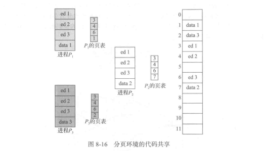
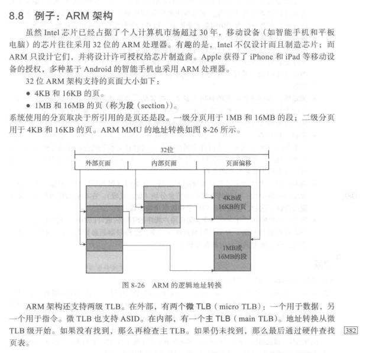

### 8.1 背景

#### 8.1.1 基本硬件

- CPU可以直接访问的通用存储只有内存和处理器内置的寄存器
- 确保每个进程都有一个单独的内存空间（实现内存空间保护）
  - 通过两个寄存器实现：基地址和界限地址
  - 基地址寄存器含有最小的合法物理内存地址
  - 界限地址寄存器指定了范围的大小
  - 内存空间保护的实现是通过CPU硬件对在用户模式下产生的地址与寄存器的地址进行比较来完成的
- 内核模式才能加载基地址寄存器和界限寄存器，特权指令只能在内核模式下执行

#### 8.1.2 地址绑定

- 源程序中的地址通常是用符号表示，编译器通常将这些符号地址绑定到可重定位的地址。链接程序或加载程序再将这些可重定位的地址绑定到绝对地址
- 每次绑定都是从一个地址空间到另一个地址空间的映射
- 指令和数据绑定到存储器地址可在沿途的任何一步中进行
  - 编译时
  - 加载时
  - 执行时

#### 8.1.3 逻辑地址空间与物理地址空间

- cpu生成的地址是逻辑地址，而内存单元看到的地址（即加载到内存地址寄存器的地址）通常称为物理地址
- 逻辑地址通常称为虚拟地址，即逻辑地址空间 映射 物理地址空间
- 这种映射是由内存管理单元（MMU）来完成
- 基地址寄存器这里称为重定位寄存器，用户进程所生成的地址在交送内存之前，都将加上重定位寄存器的值

#### 8.1.4 动态加载

- 为了获得更好的内存空间利用率，可以使用动态加载，即一个程序只有在调用时才会加载
- 当一个程序需要调用另一个程序的时候，调用程序首先检查另一个程序是否已加载，如果没有，可重定位链接程序会加载所需的程序到内存，并更新程序的地址表以反映这一变化

#### 8.1.5 动态链接与共享库

- 动态链接：在二进制映像内，每个库程序的引用都有一个存根（存根是一小段代码，用来指出如何定位适当的内存驻留库程序，或者在程序不在内存时应如何加载库）

### 8.2 交换

- 进程必须在内存中以便执行，不过进程可以暂时从内存交换到备份存储，当再次执行时在调回到内存中
- 正常情况下，禁止交换；当空闲内存低于某个阈值时，启用交换
- 时间成本很高

### 8.3 连续内存分配

- 内存通常分为两个区域，一个用于驻留操作系统，另一个用于用户进程

#### 8.3.1 内存保护

- 当CPU调度器选择一个进程来执行时，作为上下文切换的一部分，分派器会用正确的值来加载重定位寄存器和界限寄存器

#### 8.3.2 内存分配

- 任何时候，都有一个可用块大小的列表和一个输入队列，操作系统根据调度算法来对输入队列进行排序
- 首次适应，最优适应，最差适应

#### 8.3.3 碎片

- 进程所分配的内存可能比所需的要大，这两个数字之差称为内存碎片，这部分存在分区内部，但不能使用
- 用于内存分配的首次适应和最优适应算法都有外部碎片，随着进程加载到内存和从内存中退出，空闲内存被分为小的片段，当总的可用内存之和可以满足但并不连续的时候，就会出现外部碎片问题：存储被分成了大量的小孔
- 外部碎片问题的一种解决办法是紧缩：目的是移动内存内容，以便将所有空闲空间合并成一整块

### 8.4 分段

8.4.1 基本方法

- 逻辑地址空间是由一组段构成，每个段都有名称和长度，地址指定了段名称和段内偏移
- 一个c程序的分段
  - 代码
  - 全局变量
  - 堆（内存从堆上分配）
  - 每个线程使用的栈
  - 标准的C库

8.4.2 分段硬件

- 段表的每个条目都有段基地址和段界限；段基地址包含该段在内存中的开始地址，而段界限指定该段的长度
- 每个逻辑地址由两部分组成：段号S和段偏移d

### 8.5 分页

#### 8.5.1 基本方法

- 将物理内存分为固定大小的块，称为帧或页帧，而将逻辑内存也分为同样大小的块，称为页或页面
- 由CPU生成的每个地址分为两部分：页码和页偏移，页码作为页表的索引，页表包含每页所在的物理内存的基地址
- 采用分页方案不会产生外部碎片，但是会有内部碎片
- 页的大小一般是4KB-8KB
- 帧表：表明哪些帧已分配，哪些帧空着，总共有多少帧；在帧表中，每个条目都对应着一个帧，表示该帧是空闲还是已占用
- 操作系统为每个进程维护一个页表的副本，每当操作系统自己将逻辑地址映射成物理地址时，这个副本可用作转换

#### 8.5.2 硬件支持

- 现代计算机都允许页表非常大，需要将页表放在内存中，并将页表基地址寄存器（PTBR）指向页表，改变页表只需要改变这一寄存器即可
- 所以如果要访问一个位置的话，就要先利用PTBR的值，再加上偏移值，来查找页表（这一认为需要内存访问，根据所得的帧码，再加上页偏移，获得真实的物理地址），所以访问一个字节需要两次内存访问（一次用于页表条目，一次用于字节）
- 为了解决上述问题，采用转换表缓冲区（TLB）
  - 是关联高速缓存
  - 由两部分组成：键和值，当关联内存更具给定值查找时，他会同时与所有的键进行比较；如果找到条目，那么就得到相应值的字段
  - 现代TLB查找硬件是指令流水线的一部分，基本不添加任何性能负担
- 有的TLB在每个TLB条目中还保存地址空间标识符（ASID），为进程提供地址空间的保护，ASID唯一表示每个进程
- 现代CPU可能提供多级TLB，以提高有效内存命中率
- 总结：
  - TLB只包含少数的页表条目，当CPU产生一个逻辑地址后，它的页表就发送到TLB，如果找到这个页码，它的帧码就立即可用，用于访问内存
  - 如果不在TLB中，那就需要访问页表
  - 将页码和帧码添加到TLB中，下次可以很快的查找

#### 8.5.3 保护

-  在页表中用一个位定义一个页是可读可写或只可读
- 有效-无效位，当该位有效时，该值表示相关的页在进程的逻辑地址空间内；否则就不再了
- 不过可能会有内存碎片（看书上）
- 事实是：一个进程很少会使用它的所有地址空间，许多进程只用到地址空间的小部分

#### 8.5.4 共享页

- 如果代码是可重入代码或纯代码，则可以共享
- 可重入代码是不能自我修改的代码
- 

### 8.6 页表结构

#### 8.6.1 分层分页

- 一种方法是使用两层分页，就是将页表再分页

#### 8.6.2 哈希页表

- 采用虚拟页码作为哈希值，哈希页表的每一个条目都包括一个链表，该链表的元素哈希到同一位置
- 每个元素由三个字段组成：虚拟页码，映射的帧码，指向链表内的下一个元素的指针
- 工作如下：虚拟地址的虚拟页码哈希到哈希表，用虚拟页码与链表内的第一个元素的第一个字段相比较，如果匹配，那么相应的帧码就用来形成物理地址；如果不匹配，那么与链表

#### 8.6.3 倒置页表

- 

#### 8.7.2 x6-64

- 采用四级分页，支持48位的虚拟地址

### 8.8 例子：ARM架构

- 

### 9.1 背景

### 9.4 页面置换

