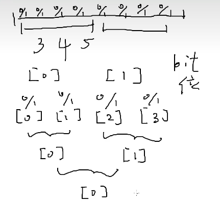
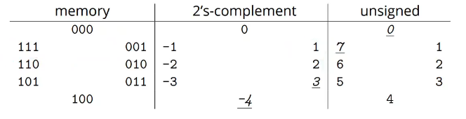
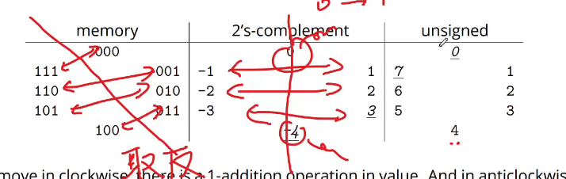

计算机的两个操作

读函数

R（address，容器）：从容器中找到这个地址，把容器中对于地址的数据读出来（容器可以理解为就是内存）

W（addre，容器，数据）：把数据写入到容器中对应的地址上

内存存放的其实是电压

把电压的高低转换为数字0101

最开始每一位都记录了0和1，然后为了方便访问读取，就按照每3个4个5个位对数据进行读取，接着上面一层又是按照这样的方式对其进行封装

说白了就是不断的写数据和读数据的一个过程

后续给了个很奇怪的假设，就是假设此时的位数是n，将每m个位一起变为一个块，那么就必然要有n/m <= 2的m次方（说是和指针有关）

对于十进制数字123，其实它本质上是一个十进制的SEQ，因为它本质上是100 * 1+10 * 2 + 1 * 3

引入实数后理解十进制和二进制，即比如实数里面的3是什么（有点抽象和虚无）

它在十进制中是3，但是他在二进制中表示的是11

即一个数具体是多少只能存在于我们心中，为了表示出这个心中的数字，我们引入了进制

但是又有了一个问题，就是进制的相加的问题

如果一个数的位数是无限的，那么就不存在问题

可是如果说一个数的位数是有限的，那么就有问题了

你比如说二进制下，11 + 01，如果限定位数为只能为两位的话，那么

就会变为了00

当然如果位数限制变为3位的话，那么就会变为100

即，数字的映射因为位数的限制出现了一些问题

所以说，正反数与二进制的映射并不是无中生有的，而是一种这种的办法

即对于二进制表示来说的取反映射应该是这样的，但是这和实际上我们（就是十进制）平常中的理解是不一样的，所以才会出现说一个数的负数应该是取反后再加一

一点理解

- 如何才会延申出这些进制的表示的呢？
- 首先，我们知道电脑都是用二进制来表示数据的，而对于不同类型的数字，计算机都限制了其具体的位数（比如int就是32位的整数，long long就是64位整数）
- 既然这样，那应该如何表示一个数字呢？依照上图，就将这样的二进制表示的一个环中的一半作为正数，另一半作为负数（也就有了符号位的说法）
- 或者说，就是unsigned的做法了