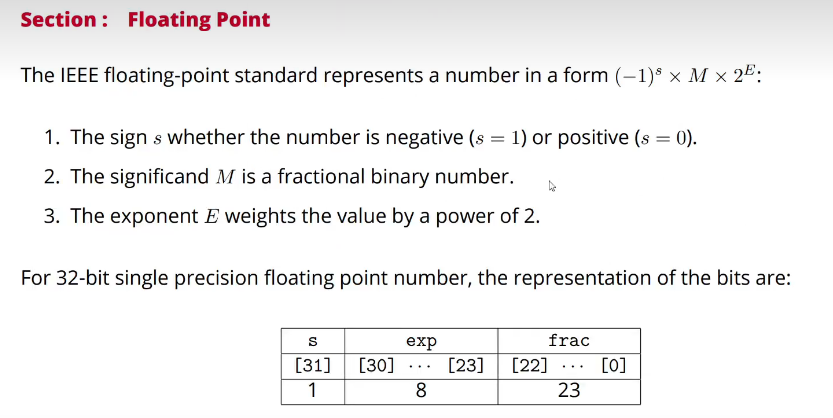

float的表示

- float有32位，即【0，31】
- 对于一个二进制的浮点数，表示应该是（-1）的s次方（其中s表示0或1，显示正负） * 1.f（f为小数点后面的尾数） * 2的e次方
- 其中s占用一位，存储在31的位置上
- f占用8位，存储在30-23的位置上
- e占用23位，存储在22-0的位置上
- 
- 而为了二进制的偏置，会对e的十进制进行-127的处理（因为e占8位，即e的二进制可以表示到0-256），偏置后的范围为-127-128

NAN

- not a number