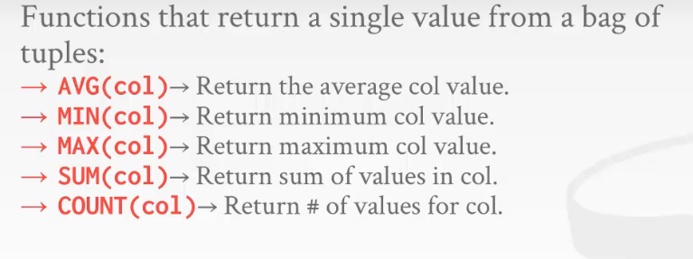

# relational languages

- 只需要告诉DBMS要查询的是什么，不需要管其内部底层的实现，只告诉DBMS我需要的是什么即可
- DBMS的职责就是高效的执行，得到我们需要的答案
  - 所以高端的DBMS都会有很好的优化器

# SQL history

- 
- 

# relational languages

- Data mainpulation language 数据的增删改查，数据操纵语言（DML）
- Data definition language 数据的定义语言，数据库的create，元数据操作（DDL）
- Data control language 数据的控制语言，像权限的管理（DCL）

- 还可以用sql定义视图，定义权限，开始事务

- 

# aggregations + group by

- 把数据的结果集，通过想要的方式聚集成一个结果
- 
- 

# string / data / time operations

# output control + redirection

# nested queries

# common table expression

# window functions

# Conclusion
