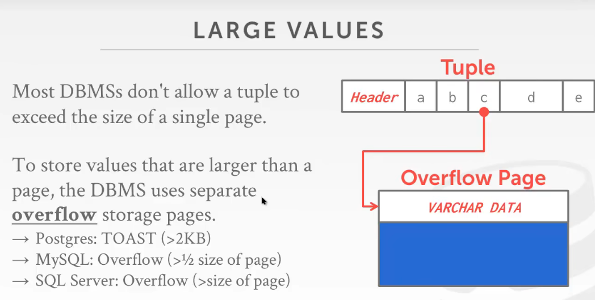
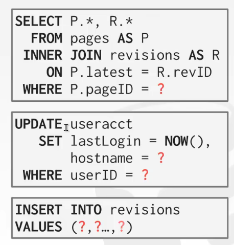
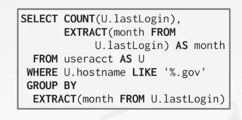
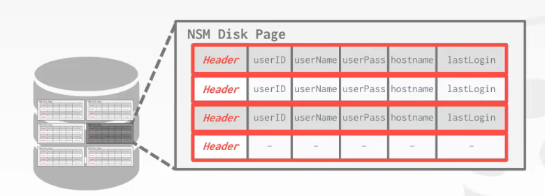
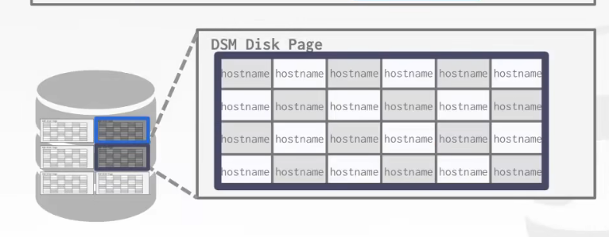

# Log-structured file organization

DBMS存储的是log records，准确来说存储的是每次操作后记录下的日志

比如说：
- 插入了一条新的record
- 删除了哪一条record
- 更新了哪一条record

如果要读取某个数据，就要把与这个数据有关的log都读一遍
- 一般都是从后往前找，找到这个数据最佳以此被更新的时候（如果从前往后找，浪费时间）
- 一个优化：给对应的数据一个索引，将同一个数据相关的log用一个索引将它们指向

但是如果log太多了的话会影响性能，所以会周期性的压缩日志
- 压缩后的日志都只保留数据本身（简化为insert record）

 

这种机制更多的用在kv数据库中
- 因为就只有一个键一个值，我们只需要最后一条更新日志即可恢复数据本身，比如说上面update了val=X，那么我们就知道id=3的数据最后的val就是X
- 但关系型数据库一条记录有多个数据，想要获取最新的数据不仅仅要最后一条更新日志，可能还要多条（因为关系型db有多个列，需要多条log维护这个值）

应用：leveldb，rocksdb，cassndra，hbase

## Log-structured compaction

日志压缩：通过删除不必要的记录将较大的log file合并为较小的log file

 

### Level compaction

水平压缩

背景：会有很多个log文件，但问题是数据A在log1中insert，又在log2中update，即对于单个log文件无论如何压缩，都无法很好的压缩掉数据A

所以就出现了水平压缩，即第一层是各个log文件，然后第二层是上一层的两个log文件合并，第三层就以此类推

参考rocksdb或leveldb

上面是说数据如何写入，下面就说数据是如何读的
- 首先从level 0层开始读，如果有的话，就代表此时的数据是当前该数据最新的版本，直接读即可
- 如果没有，就代表该数据的操作可能已经被压缩到下面一层了，所以就往下一层读数据
- 以此类推的往下走

 

 

### Universal compaction

不是分层的，数据都是在同一层，合并后的数据都还是在同一层

优点：写数据的时候将随机写变为顺序写，极大的提高性能，适用于写多读少的情况

 

 

 

# Data representation

数据在磁盘上是如何表达的

 

使用原生cpp的数据类型，通常比任意精度数字块，但是会存在舍入误差的情况

如上图，直接打印数字结果是没问题的，但是如果要打印结果的后20位，就会出现精度缺失的问题

 

DB的解决办法是字面上存储的是字符串

小数之类的通常存储在一个精确的、可变长度的二进制表示中，并带有额外的元数据

类似于VARCHAR，但是不存储string

Demo：Postgres, SQL Server, Oracle

 

## Postgres：numeric

ndigits：这个小数有多少位

weight：权重

scale：指数

sign：是正数还是负数还是0

digits：字符串（用字符串来存数字是多少）

 

 

## Mysql：numeric

intg：小数点之前有多少位

frac：小数点之后有多少位

len：这个数据有多少的字节长

sign：这个数是正还是负

bug：指向字符串

 

 

## Large values

大多数DBMS不允许元组超过单个页面的大小，因此要存储大于一个页面的值，DBMS必须使用单独的溢出存储页面

 

不同DBMS的处理
- 如果记录的长度超过了2KB，那么PG数据库就会将数据单独拿一个page来存储，一页是8Kb
- mysql则是大于8KB就会触发（在原位置存储地址，然后取数据的时候去地址拿即可；一页是16kb，则mysql一页最少存储两行数据）
- SQL server（行数据不能超过整个page的长度，即sql server一页最少要存一行数据）
- 

 

如果溢出页也不够的话，就溢出页后面再加上溢出页

尽量不要存储太大的数据，浪费资源（如果某个数据占用一页，那么就相当于读取一页只读到了一行数据..）

对于图片的做法，就可以把这类数据用对象存储，然后本地db记录一个地址就好了

 

有些系统允许在外部文件中存储非常大的值，作为BLOB类型处理
- Oracle: BFILE数据类型
- 微软:FILESTREAM数据类型

即本地存储这个文件的地址，用的时候读地址上的数据即可

 

 

 

# System catalogs

meta-data（可以理解为是系统表，与DBMS配置相关的元数据）
- tables,columns,indexs,views
- users,permissions
- internal statistics

几乎所有数据库都自己管理这些meta-data，并且是把数据存储在表中

DBMS都将meta-data当作数据存储在系统表中

可以查询DBMS的内部INFORMATION_SCHEMA目录来获取关于数据库的信息

 

 

 

# Database workloads

DBMS可以以不同的方式存储元组，这些方式更适合OLTP或OLAP工作负载

relational model没有规定我们的元组数据是如何存储的，所以可以根据不同的场景，选择不同的存储模型

 

 

## OLTP

On-line Transaction Processing

每次只读取/更新少量数据的快速操作

行存储

在线事务处理，快速的操作，读写数据量很小的元组，高并发，但是每次处理的数据量又很小
- 读取/更新与数据库中单个实体相关的少量数据的简单查询

更倾向于写数据

一般是业务场景下用的多

 

 

## OLAP

On-line Analytical Processing

读取大量数据来计算聚合的复杂查询

列存储

联机分析处理，一个很复杂的sql，涉及多个表的join
- 跨多个model读取大量数据库的复杂查询

更倾向于读数据

一般是公司内部数据分析，大数据上用的多

 

 

## HTAP

hybrid transaction + analytical processing

OLTP + OLAP在同一个数据库实例上一起使用

OLTP + OLAP

 

 

 

## Bifurcated environment

工作负载时分开的

平时操作的时候用OLTP，然后用extract transform load将数据进行转换，转换到OLAP中进行分析

一些公司的场景

 

 

 

# Data storage models

其实我们平常使用sql语句，都是直接查询数据，但是不管数据库的底层是如何实现的

所以就衍生出按列存储和按行存储

 

 

## N-ary storage model（NSM）

一个tuple存储了多个属性，就是按行存储（适合OLTP）

查询往往只对单个实体进行操作

优点
- 快速插入，更新和删除（只处理这一行即可）
- 适合需要整个元组的查询（需要一整行数据的时候就是优势了）

缺点
- 不适合扫描表的大部分属性的子集，比如说要查询某一列所有的数据，那么这种存储方式就要遍历全表，但是我们可能只需要其中一列的数据，那么其他列的数据的读入其实就是浪费的了，做了很多的无用功

 

 

## Decomposition storage model（DSM）

DBMS存储一个页面中连续的所有元组的单个属性的值（适合OLAP）

适合对表属性的子集执行操作

列式存储的两种方式：（遇到的问题，如何甄别这个数据属于哪一个对象的）
- 一种是固定长度的偏移，每个值对于一个属性来说都是相同的长度（即规定所有列的第一行存的是对象A，第二行存的是对象B，第三行存的是对象C）
- 另一种是对于还有每个属性的列，都加上该元组的id（每一列中的每个数据都记录自己属于哪一个对象，**用额外的空间存储id**）
- 

优点
- 减少浪费的I/O量，因为DBMS只读取它需要的数据
- 更好的查询处理和数据压缩

缺点
- 由于元组拆分/拼接（因为可能某一个元组无法完全存取数据的某一列，就会面临元组的切分的情况，所以数据的删除和擦混入就会有合并拼接的操作，从而会影响性能），点查询、插入、更新和删除速度较慢（比如需要一行数据，就会变为随机IO，非常慢）

 

 

 

# Conclusion

存储引擎和数据库之间的关系十分密切