# index

- DBMS的工作就是用最佳的索引去执行每个查询
- index的定义：是表中一部分数据的副本
  - 比如有一个公司内部人员的表，要按照年龄建立索引，一般来说将年龄和用户的id抽取出来单独做一个副本，这个小表只有两列，一个是年龄，一个是id
  - 同时这个小表是有排序的，即按照年龄进行排序
  - 把大表的某些列作为小表
- 这个小表和大表逻辑上是同步的
  - 如果在大表上添加了一个新的员工的信息，那么小表上也要同步上来
- 目的：执行的时候能够加速查找插入删除
- 权衡：存储的开销（索引本身的大小）；维护的开销（对于大表的增删改查也要同步到索引上去，维护的效率权衡；如果建立的索引太多，那么任何一个写操作都会需要更多的成本去维护）
  - 其实就是牺牲一定的空间复杂度，降低查询时的时间复杂度

# B+tree overview

- 

# use in a DBMS

## B+tree properties

- 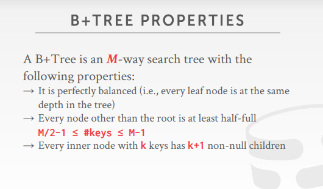
- B+ tree是一颗M路查找树（即多路查找树）
  - 是完美平衡（每个叶子节点都是相同的树深度）和自平衡（数据的插入和删除都会自动调整，以达到平衡）的
  - 能在**O（log n）**的时间复杂度中实现数据的查找，插入和删除，并且也支持**线性遍历**
  - 除了根节点以外，其他的所有节点至少是半满的，即M/2 - 1 <= keys <= M - 1
  - 每个有k个键的内部节点，都有k+1个非空节点（用于存储叶子节点的地址）

## nodes

B+tree的每个结点都是由一个kv对数组组成的

- B+tree的**叶子节点**是以page为单位存储数据的，所有对磁盘的读写非常的友好
  - hash表天然不是分块，如果要存放到硬盘中，就要想怎么把数据分块，以此方便的存储到硬盘中，因为磁盘是按照页数存储到硬盘中的
- 
- B+tree的**非叶子节点**存储的是数对node* 和key，其中key存储的是该node的数值，node*存储的是叶子节点的地址（表示该叶子节点的所有值都小于此时的second上的值）
- B+tree的叶子节点存储的也是key和value，key一般存储的是主键id（如果是辅助索引存储的就是需要排列的数据），value存储的是具体的数据（主键索引的话，存储的就是数据本身；辅助索引可能存储的是行id，用于回表）
- 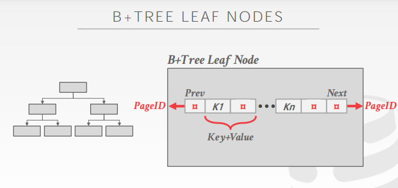
- B+tree的叶子节点前后都有一个point，即prev pointer和next pointer，如果是以page为单位存储数据，那么存储的就是指向前后的叶子节点的pageid
- leaf nodes也可能这样存储
  - 

## leaf node values

- 
- leaf node的节点中value的两种存储方式
  - 数据的行id（比如说公司员工表中的员工id，类似二级索引，也可以是记录的行id，查找数据就是拿到了记录的行id，然后去内存中查找;指向索引项对应的元组位置的指针）
  - 整个行数据（主键索引，很多数据表本身就是按照B+树存的...，查询数据可以不用回表;元组的实际内容存储在叶子节点中，二级索引必须存储记录id作为它们的值）

## b-tree vs b+tree

- 相比B-树，B+树只在叶子节点存储数据
- B树会将数据存储在非叶子节点上，空间上更加的高效；而且每个键值只出现了一次；但是缺点就是，如果先要进行范围查找的话，就要进行中序遍历，时间（遍历、读取数据页的时间）空间（可能会将一些不要的磁盘页读入）上比较差

## selection conditions

- 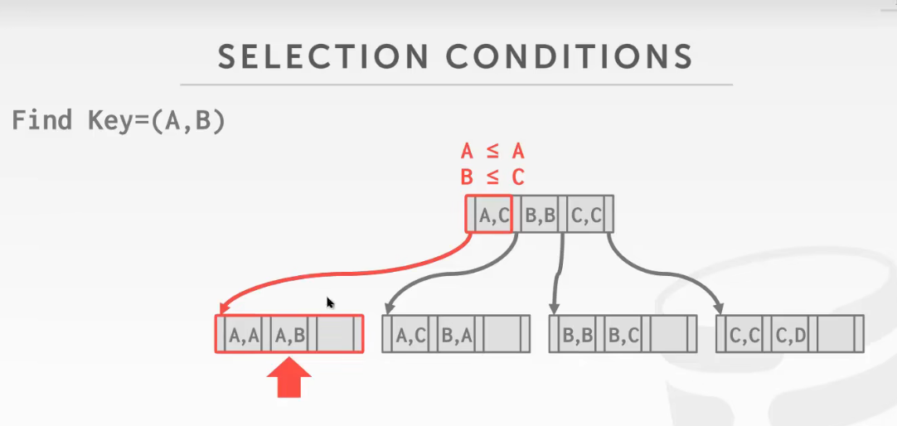
- 这里在第一个叶子结点查到A之后，就会往右边，即下一个叶子结点继续找
- 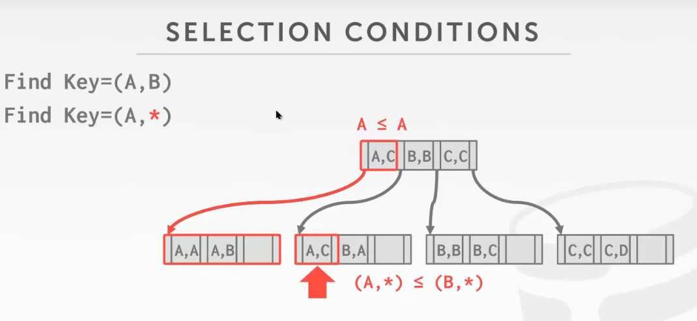
- 比如说对于<a,b,c>建立的索引，支持(a=5 AND b=3) 的搜索，支持(b = 3)的搜索
- 而如果要找的是find key = (*,B)的话，他就会跳着搜索，你比如说先找AB，再找BB，再找CB，一直这样找下去，这个叫做skip scan跳跃搜索，虽然比全表扫描好很多，但是效率还是不如普通的二分查找
  - 所以，一般模糊搜索都建议要走右模糊，因为要尽量确定做左边的值，这样就可以把要查询的范围收窄

## B+tree - insert

- 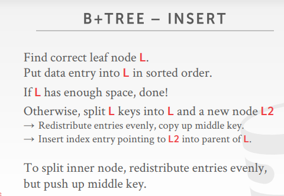

- 先找到要插入的叶子节点

- 如果叶子节点有空间的话，按照顺序放入数据
- 否则，将叶子节点拆分为两个节点，平均分配键值对，并在当前节点的父子节点中插入新增节点的索引

## B+tree - delete

- 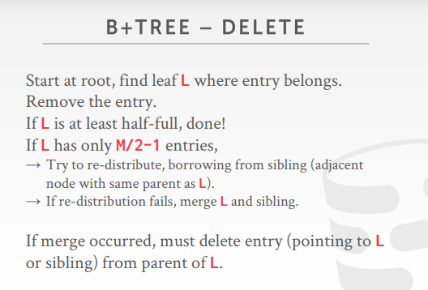

- 先要找到要删除的数据所在的叶子节点

- 如果删除该节点后数据仍然大于一半，则可以直接删除，完成
- 否则
  - 尝试重新分配，从相同父节点的相邻节点借数据合并
  - 如果分配失败，就合并父节点和其他兄弟节点（如果发生了合并，就要从父节点中删除当前节点的索引）

- 有些时候可能会出现那删除数据后延迟合并的现象，因为可能现在留有了空位，但是不久后又会放入新的数据进来，所以会延迟合并，这样做能有效的提高性能

## B+tree - duplicate keys

- 如果两个主键上的值相同，该怎么处理

- 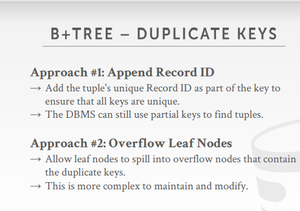

- 方法一：将元组唯一的record id添加为键的一部分，确保所有的键都是唯一的
  - 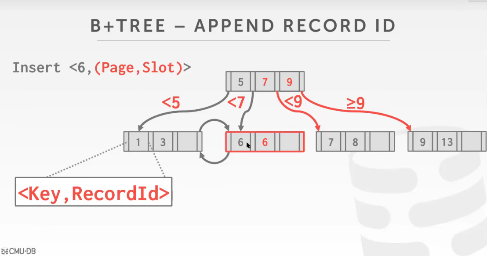

- 方法二：给当前的页后面外界一个新的页，把重复值的页放到外接的页上面
  - 

## clustered indexs

- 聚簇索引，也叫做聚集索引
- 判断：数据是不是按照主键索引去组织的（行的数据是集成在了主键索引中，此时的索引就是聚簇索引，即索引本身把数据给阻止起来了，例如mysql）
- 不是聚簇索引的：数据的kv对中，v存储的是数据的页号和对应的slot号，即要进行回表才能获取到具体的数据
- DBMS会按照主键指定的排序顺序存储数据
  - 可以是堆或者索引阻止的存储
- 很多DBMS会使用聚集索引
- 如果一个表不包含主键，DBMS会为他们生成一个隐藏的row id主键

- 如果是聚簇索引的话，进行全表扫描的时候，从磁盘中读取数据就是顺序IO，高效
- 即数据的组织方式和存储方式是一致的
  - 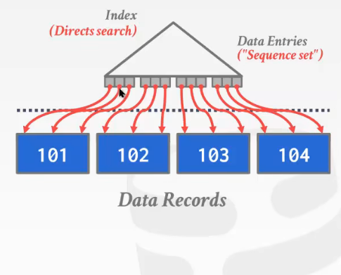

- 而如果是非聚簇索引，那么进行全表扫描的时候，数据的排列顺序和它在磁盘上的存储顺序是不同的
- 那么就要先记录每个数据所在的page，进行统计后再按照顺序读取

- 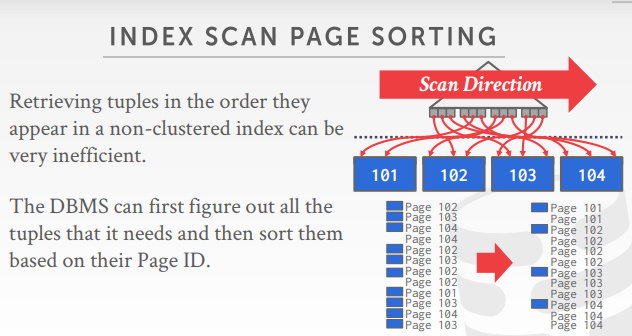

## non-unique

- 在非唯一索引中数据如何存储

- 方法一：多次存储重复的键值
- 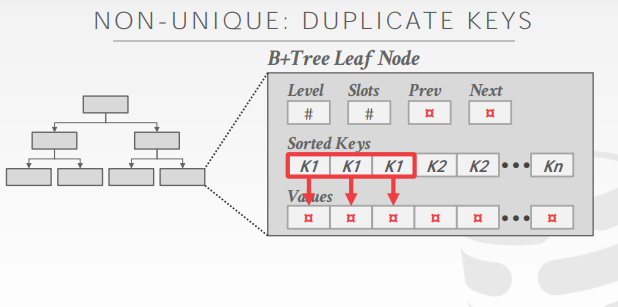
- 方法二：每个键只存储一次，并维护唯一值的链接列表
- 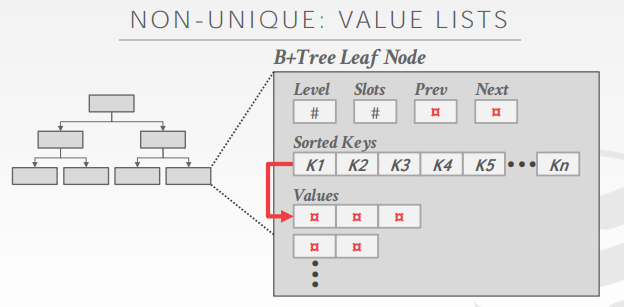

# B+tree design choices

- B+树的一些优化改进的设计

## node size

- 存储设备读取数据的速度越慢，B+树的最佳节点大小就越大
  - 每次数据的读取，尽量把更可能多的数据读会内存（提高效率）
  - 但一些直接在内存中的数据库要求在内存中结点要求要小（读到的冗余数据越少，查询效率更高）

- 根据工作负载的不同，最佳大小可能有所不同（取决于用户）
- 需要权衡的是对于叶子节点的扫描和根节点到叶子节点的遍历
  - 如果经常是全表遍历的话，B+树的结点最好大一点，因为这样存储的数据更多（比如OLAP型）
  - 而如果是点查询多的话，比如OLTP型的话，就需要小一点的B+树结点，因为点查询会在结点之间跳跃，如果page比较小的话，可以降低开销
  - 最好和文件页的大小一致，或者等于文件页大小的倍数
  

## merge threshold

- 提高触发合并条件的阈值，即延迟page之间的合并
- 一些DBMS在节点未满的时候不会立即合并节点（让更小的节点存在可能有利于查询）
- 延迟合并操作可能会减少重组的数量
  - 因为两个结点的合并，可能会引起上层的变化
- DBMS延迟合并后，也会周期性的rebuild整棵树

## variable-length keys

- 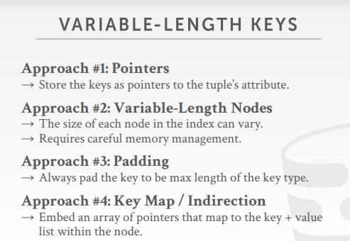

- 对于变长的key的处理

- 方法一：键值部分存储指向真正数据的指针，从而保证每个数值都一样长
- 方法二：设定每个节点的长度为可变长度，但是麻烦的是需要对其进行内存管理（不太推荐）
- 方法三：始终给每个键选择的大小为最大值（给不够最大值的补上padding）
- 方法四：嵌入一个数组，数组的指针指向最终的key+value（存入的是slot）

## intra-node search

- 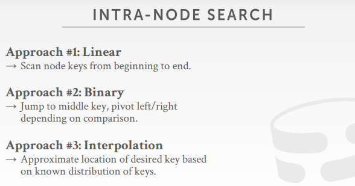

- 如何在leaf node中查询具体的数据
- 一个节点是16K，而一行数据也就几百字节，则一个节点可以存储几百上千条数据

- 方法一：线性搜索，从头到尾扫描节点键
- 方法二：二分查找
- 方法三：插值法（根据已知的几个数据的位置，推断要查询的数据在哪儿，有点类似三分四分查找的感觉）

# optimizations

- B+tree的相关优化

## Prefix Compression

- 前缀压缩

- 同一个叶子节点中排序的键可能会用重复的前缀
- 所以，与其每次存储整个键值，不如提取前面通用的前缀，然后只存储每个键不同的后缀
- 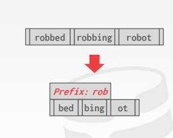

## deduplication

- 有一种情况，前面几个前缀就足以区分不同的数据了，没必要把全部的数据都保存
  - 即在非唯一索引中，同一个key存储多个副本的情况

- 所以可以把多余的后缀去掉，可以只存储一个密钥，然后用一个元组维护多个键值
- 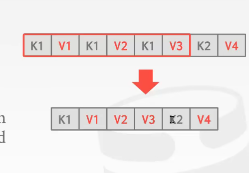
- 我理解就是，发现这几个不同的value对应的key都是一样的，所以就把它们都压缩到一起

## Bulk Insert

- 构造B+ 树最快的方式，先将所有key排序，然后自下向上建树
- 按批插入
  - 因为我们知道一个一个插入值到B+树里面是非常低效的，所以就把这些数据先排序组成一个b+树
  - 然后把这个b+树merge到主b+树里面

## Pointer Swizzling

- 指针和地址混写

- 背景：
  - 节点使用页面id来引用索引中的其他节点。DBMS必须在遍历期间从页表中获取内存位置

- 但，如果已知的page在内存中，那么就不需要先去查页表再得到数据，而是直接记录其在内存中的地址，用的时候直接查就行了

# conclusion

- B+树几乎一直都是做数据库索引的准则（标准）