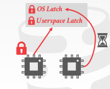
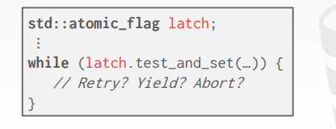

# Background

前面的操作中，都假设只有一个线程去操作数据结构，但实际操作中是有多个线程操作数据库的

因此需要研究多线程如何安全的执行查询

在实现线程安全的同时，也要注意如何优化磁盘IO

<br/>

也存在一些单线程的数据库（比如redis，只支持单线程去操作，一个用户操作完，别的用户才能进去；当然6.0以后开始支持多线程了）
- 但redis还是比较高效的，有一部分是因为不需要考虑多线程并发的问题

<br/>

并发控制分为两种：

- logical correctness：一个线程能够看到它应该看到的数据（事务并发设计的概念）
- physical correctness：物理上的，数据的内部表示是否正确稳定的（本节课的重点）

<br/>

<br/>

<br/>

# Latches overview


<br/>

## Locks

指代逻辑上（宏观上）的锁，保护的是数据库中某个具体的数据（逻辑上的数据）

一般是被事务持有（事务上说的拿锁、放锁都是指这个）

被修改的数据可以被回滚

同时，针对死锁有检测和预防

<br/>

<br/>

## Latches

指代数据结构上（微观上）的锁，保护的是数据库中某个具体的数据结构

- 比如说上面说要锁一行数据，那么就会在那个数据结点上给一个latch

- 再或者说在B+树插入或删除数据的过程中，沿途也会加上很多的锁

数据不需要回滚

对于死锁，没有具体的解决方案

<br/>

<br/>

## Latch modes


<br/>

### Read mode

读锁（共享锁，S锁）；可以多个线程持有读锁

<br/>

<br/>

### Write mode

写锁（独占锁，X锁）；只能一个线程持有写锁

<br/>

<br/>

## Latch implementations

锁的实现方式

<br/>

### Blocking OS Mutex

OS原生支持的，优点是简单方便

缺点是不能用于大规模竞争并发的场面（拓展性低）

比如cpp中的`std::mutex`

```cpp
std::mutex m;// 底层实现还是pthread_mutex_t
m.lock();
m.unlock();
```

<br/>


实现：

- Linux接口中的pthread_mutex_t，底层是futex
- 在用户态有一个flag，如果能够拿锁，就标记这个变量flag
- 如果此时有新的线程来拿锁，发现变量被标记了，线程就直接陷入内核态（有点类似sleep，但优点是sleep不会大量竞争消耗系统资源）
- 如果上面的线程又把锁释放了，那么OS就会唤醒上面进入内核态的线程
- 
- 缺点：把线程睡眠又唤醒，这种开销是比较大的

<br/>

<br/>

### Test and set spin latch

自旋锁（Spin lock）

优点：非常高效（单个硬件指令就可以支持加解锁）

缺点：没办法应用于大规模的竞争，同时对缓存和OS不友好对OS也不友好



<br/>

实现：

- 标志位latch，锁上的时候设置为1，解锁的时候设置为0
- 加锁的过程是用一个while去检测latch是否为0，如果为0就加锁，为1的话就一直死循环，即在用户态不断的循环（latch是std::atomic<T>）
- 所以数据的实现必须是原子性的，操作系统底层支持原子操作，即修改数据的过程中，别的线程是不能参与的
- 而这里spin latch的实现方式就是**test and set**，是由硬件指令支持的，执行期间不会被打断
- 包含了两个步骤：把给定的内存地址设置为1，然后返回之前的旧值

- 在用户态不要用自旋锁（因为自旋锁，别的线程如果一直不释放锁，就会导致竞争的线程极度的浪费资源，因为多个线程会不断的检测这个锁有没有被解开）
- java给的一个思路就是，锁先疯狂的自旋，如果超过一定的时间，就会陷入内核态

- 建议：不要在用户态使用自旋锁，除非你真的知道它的实现

<br/>

<br/>

### Read-write latches

读写锁，但是不能作为锁的一种实现

比如说此时有两个人加了读锁，那么后面第三个人如果想要加写锁，就要等前面两个人放掉读锁后才能继续写锁

再比如说如果此时还有人想加读锁，就不能加了，因为这里的加锁是要讲究**顺序**的，必须等上面的人把写锁加了，才能继续加读锁

<br/>

<br/>

<br/>

# Hash table latching

hash是比较好加锁的，比如说开放地址hash，如果找不到slot就会往下找，因为查找的方向永远是从上往下的，不会有死锁（B+树可能会死锁）

但如果要扩容的话，就要加一个全局的写锁（global lock），因为扩容后数据结构会全部改变（不在扩容阶段，可以加局部锁）

<br/>

<br/>

## Page latches

比如说要查找一个数据D，那么就要给slot所在的page加上一个读锁，如果当前page没有，就往下一个page去找，同时也要释放当前页面的latch

即**以page为单位**加读写锁

java里面的ConcurrentHashMap底层就是分段hash，并发控制用的就是page latches

锁的粒度不细，从而保证了一定的并发性质

<br/>

<br/>

## Slot latches

以slot（槽）为单位加读写锁

粒度变得更加的细致了，更加能够避免并发冲突

缺点：要维护的latch数量太多，大多数的场景是无法承受的

<br/>

go里面的map是不支持并发的，sync.map才是支持并发的

读写分离，主的hashtable是只读的，副的hashtable是用来写的，写的完后定期的把它刷到主的hashtable上

好处：读的时候是无锁的

<br/>

<br/>

## Compare and swap

构造无锁的hashtable的一种方法（实现无锁的一种解决方案吧）

```cpp
__sync_bool_compare_and_swap(&M,20,30);
//	M是操作的变量的地址，20是原来这个变量上的值，30是我想要改为后得到的值
//	语义就是把M变量的值改为30
```

<br/>

实现：

- 先让OS看看当前的M是不是20，如果是20的话就要把它锁住，然后把它改为30
- 先比较，在交换设置，借此解决并发问题
- 这是一个原子的操作
- 给定原值就保证了线程之间是没有冲突的
- 返回的是true或false

CAS也是原子指令，由硬件支持的，和TAS相比，TAS是在单个内存word（或字节）上实现的


缺点：只会告诉你是否失败，但如果失败了的话就要自旋的去操作

hashtable插入值的时候可以这样做

<br/>

<br/>

<br/>

# B+tree latching

为何要研究b+ tree的并发：实现多线程的读写B+树

需求：
- 要保护结点内部的数据，不能让多线程同时的修改数据
- 结点和结点之间会有合并的操作，page之间的合并，也不能让多线程同时去操作

比如说要删除44，那么删除后发现要合并页，但是此时有人要查询41，去到原本41的位置的时候，发现没有（因为此时页数发生了合并，数据跑到另一页了）

<br/>

<br/>

## Latch crabbing/coupling

螃蟹协议

<br/>

过程：

- 先获取根节点的锁，如果发现数据在左子树，就先把左子树结点的数据上锁
- 然后再判断锁上了左子树后，根节点能不能解锁，如果能解锁就解锁
- 然后再从左子树找它的子树，依次循环这样

<br/>

能解锁的条件（safe node）

- 当发生数据更新（或插入删除）的时候，不会发生split（分裂）或merge（合并）

<br/>

find

- 从根节点开始往下寻找

- 先拿到孩子结点的锁
- 然后把父节点解开
- PS：所以就像螃蟹一样一直往下走hhh

<br/>

insert/delete

- 从根节点开始往下找

- 先锁上孩子结点的锁
- 但是要判断孩子结点是不是一个安全的结点，如果不安全就不能放锁；安全的话就可以解锁

<br/>

思考：发现每次操作都要先锁根节点，所以根节点就变为了瓶颈

- 这是一种悲观的心态
- 而绝大部分的操作其实是不会引起根节点的变化，所以不一定一上来就加锁

<br/>

<br/>

**better latching algorithm**

一种乐观加锁的方式

search不变

insert/delete的时候，加的是读锁（如果加了写锁，其他线程就必须阻塞）

一路读锁，发现子节点 not safe的时候，释放所有的锁，然后再从头看是加写锁

但是也有不好的地方，你比如说children结点导致了parent结点也要改，那么只能推导重来，从根节点重新给它加写锁

而这种方案，赌的就是绝大部分的操作是不会对上层的索引有修改，就大部分的操作只会修改叶子结点，不会修改上层的结点

一旦发生了修改上层结点，就回滚

<br/>

<br/>

不管悲观还是乐观，锁都是从头往尾加的
- 所以说，如果你加锁的过程中，给children加锁的时候发现加不了锁，就只能等待了

而B+树厉害的地方就是可以遍历加锁

<br/>

<br/>

<br/>

# Leaf node scans

因为B+树是可以支持范围搜索的，即比如说find keys > 4，那么就直接找到4的位置，然后用下面的链表从左往右开始遍历，一边遍历一遍加锁

可是呢，如果加的是读锁，就没事，如果加的是写锁，那么就可能会出现死锁的情况

比如说又有一个update keys < 10，那么就可能会先锁住key为9的数据，那么就会出现，find keys > 4 拿着key为5的锁，要争夺key为9的锁，update keys < 10拿着key为9的锁，要争夺key为5的锁

就会有死锁


可惜B+树的latch天生不支持死锁检测

解决办法：只允许往一个方向走，比如说只允许find keys > 4这个方向，不能反方向查询

但又想要倒序的遍历，解决办法就是倒序索引，就反方向的构建一遍索引

所以对于B+树的索引，要添加一些规则进去

<br/>

<br/>

<br/>

# Conclusion

让一个数据结构实现线程安全，是非常困难的

在B+树上用的技巧，也可以用在其他的数据结构上的，例如skip list