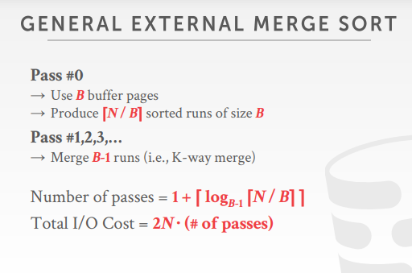
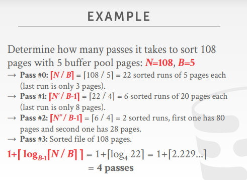
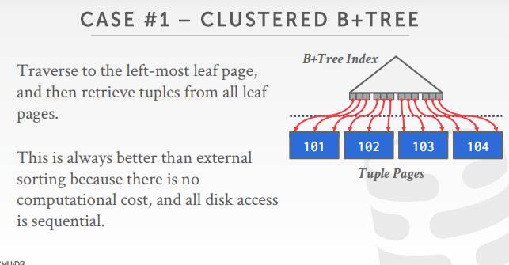
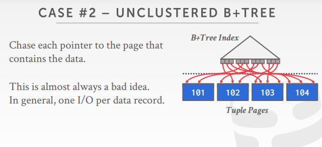
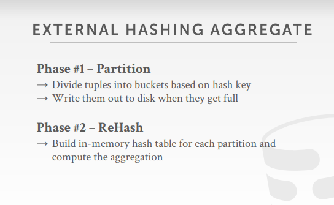
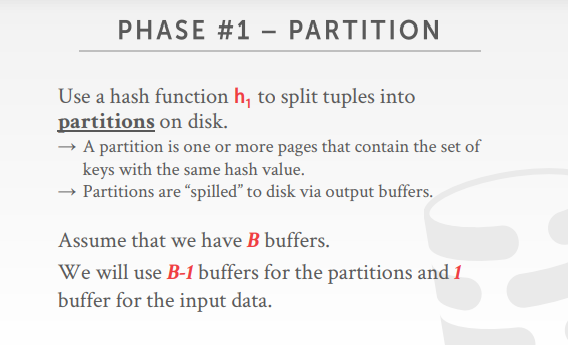
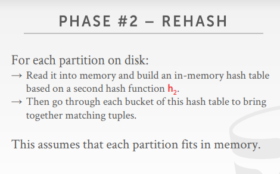

# background

- 硬盘中存储了大量的数据
- 查询过程中的所有中间结果不能存放在内存中，即查询过程的中间结果也要先存到磁盘中（因为内存空间有限，中间结果太大）
- 希望最大化的利用连续读写

# why do we need to sort?

- 关系型数据库没有要求数据要按照特定的顺序排列，但是查询往往希望按照特定的顺序检索元组
- 一些语句的操作需要（比如去重操作（DISTINCT，要先排序再去重），聚合操作（GROUP  BY，先排序再聚集），ORDER BY等）

# sorting algorithms

- 如果数据能够在内存中排序（即要排序的数据都在内存中），那么就可以使用标准的排序算法，比如快排等
- 如果不行，那么就需要一种排序方法，能将大于内存大小的数据sort，同时兼顾将数据写入磁盘的成本

# external merge sort

- 要排序的数据不是在内存中的，而是在硬盘中的

- 将数据集分割成单独的运行，然后分别排序
- 阶段一：排序（对装入主存的数据块进行排序，然后将排序后的数据块写回磁盘上的文件中）**Sorting**
- 阶段二：合并（将排序后的子文件合并成一个更大的文件）**Merging**

## sorted run

- 假设我们是对数据的某一列进行排序，那么就将这一列设为k，数据的值设为v，组成一个kv对
- k必然是要进行排序的那一列数据
- 所以v的设置就有两种方式
- 方式一：v存储的是一整行的数据（early materialization，尽早的物化数据）
  - 排序后不需要回表
- 方式二：v存储的是记录的id或者主键值（late materialization，晚物化，如果数据比较大，那么数据的移动开销就会很大）
  - 后续就拿着这个id进行回表

## 2-way external merge sort

- 假设：数据集被分解为N个页面，DBMS的缓冲区有B个缓冲页来储存输入和输出数据

### phase

- 阶段一：将表中的数据页读入到内存中，将该页的数据进行排序，然后把排序好的结果返回给磁盘
  - 

- 阶段二：递归的将数据页成对成对合并（使用三个缓冲页，2个输入页，1个输出页）
  - 

cost

- 

### example

- 假设当前有page1和page2
- 就先把page1放到内存中进行排序，把得到的结果1写入磁盘中
- 再把page2放到内存中进行排序，把得到的结果2写入磁盘中
- 此时磁盘中有page1，page2，结果1，结果2
- 然后在内存中开一个3个page的buffer，把两个结果都放到内存中（进行归并的排序），把得到的结果放到第三个页中
- 归并后把这个排序好的页放到磁盘中，接着再排序，再放入磁盘
- 

### double buffering optimization

- 发现该算法只需要3个缓冲区页来执行排序，但是我们的内存buffer远远不止三个buffer，即这个思路没有有效的把空间利用起来

- 当发生排序的时候，在后台预先取下一次要运行的数据页，并在系统当前处理其他页面的时候把它放到第二个缓冲区
- 不断的利用磁盘读取数据，减少每一步的IO请求的等待时间
- 即利用更多的内存，实现提前拉取数据的目的

## general external merge sort

- N路归并排序
- 阶段一：使用B个缓冲页，大表有N个数据页，输出[N/B]个排序结果页
- 阶段二：使用k路合并对剩余的页面进行合并
- 
- 

## using B+trees for sorting

- 如果必须排序的表的属性已经在B+树上有了索引，那么就可以使用它来加速排序
  - 即不需要排序，直接使用
- 通过直接遍历树的叶页，得到排序后的数据来检索元组
- 这总是比外部排序好，因为没有计算成本，而且所有磁盘访问都是顺序的
- 分类：聚簇索引和非聚簇索引的B+树

### clustered index

- 聚簇索引，数据提早物化，已经放到B+树里面中，不需要回表

- B+树的数据结点和文件页是一一关联的，每一个叶子结点的数据，和文件页里面的tuple是一一关联的
- 

### unclustered index

- 非聚簇索引，数据延迟物化，只记录行id，要得到数据的话后续还要回表
- 有点类似随机IO，相当于随机读数据
- 叶子结点的内容和文件本身是不关联的
- 

# aggregations

- 将多个元组**聚合**为单个标量值
- 有两种方法
  - 排序
  - 哈希

## sort aggregation

- 将数据过滤后，对数据进行排序，然后聚合去重
- 
- 如果sql语句的结果其实是不需要对原数据进行排序，那么上述排序的方法就会很耗费时间
  - 比如说group by分组，不需要特定顺序
  - 比如说distinct中的重复项（不需要顺序）
- 所以在上述情况中，hash是一个更好的选择
  - 只删除重复的数据
  - 比排序更加的高效

## hash aggregation

- 对于每个记录，检查hash表中是否有该条目
  - DISTINCT：丢弃重复项
  - 分组依据：执行聚合计算
- 如果所有的数据都放在内存，那么处理就变得十分容易，但如果要溢出磁盘的话，就要特殊处理（所以我们研究的就是external hashing aggregate）
- 

### partition

- 
- 分区（根据hash键将要排列的数据划分为桶，当桶填满后将桶里面的数据读入磁盘中，因为这里假设数据量非常的大，不能全部放到硬盘中）
- 假设总共有B个buffer page，那么就将B-1个page作为分区，1个用于输入数据的缓冲区

- 使用散列函数h1将元组拆分为磁盘上的分区（h1是用于将数据分隔开来的）
- 把所有相同hash值都位于同一分区中
- 按照分区将数据放到磁盘中
- 
- 其实这一步主要是将每个数据尽可能的分隔开来，以便后续的操作

### rehash

- 
- rehash（为每个分区建立内存哈希表并计算聚合）
  - 为什么这里还需要rehash，因为之前phase中的hash函数可能发生碰撞，因此需要rehash

- 把每个分区得数据都读到内存中（假设每个分区都适合内存），再进行以此rehash，就可以把第一次发生碰撞的值给找出来
- 对于磁盘上的每个分区，将其读入内存并构建内存哈希表（基于第二个哈希函数h2，h2适用于将数据按照指定条件分割）
- 然后遍历该hash的bucket以匹配元组
- 

### hash summarization

- 存在一些场景，需要对数据进行求和，max，min，或avg的运算
- 所以hash2函数（第二个hash函数）就应该存入的是一个kv对
- 

# conclusion

- 没有说哪一种方法比较好，只能说看情况来选择
- 优化：
  - 把多个文件页组成文件块
  - 将随机IO变为顺序IO
  - pre read