# multi-version concurrency control

- 虽然也是一种并发控制手段，但它经常和前面几种方法联合在一起做并发控制（例如mysql就是利用mvcc和2PL做并发控制）
- DBMS在数据库中对每个数据都维护多个版本
- 当事务修改数据的时候，DBMS不是修改原来的数据，而是创建该数据的一个新版本
- 当事务读取数据的时候，会读取在当前事务启动时存在的最新的版本

## 由来

- 为什么会有MVCC的思路
  - 在2PL下，修改数据会加上写锁，这样别的事务就无法读取该数据（问题是会降低并发度，因为这里的读数据，其实可以只读一个原数据的副本即可）
- 由此mvcc的思路就是，留下数据的历史版本，即使修改了数据，但早先的事务读的时候还是可以读历史数据而不用阻塞
  - 即使修改了数据，也不会阻塞其他事务去读它的历史版本的，换言之，要留下历史版本给其他事务读取
  - 2PL中读数据会加上S锁，但S锁会导致数据无法修改；而有了mvcc的话，数据的写入只是给它加了一个新的版本，并没有真正的修改数据

- 总结

  - writers do not block readers

  - readers do not block writers

## 推论

- 事务可以去读一个一致性的快照snapshot（相当于无锁读）
  - 即数据库的读数据不受其他事务的影响
  - 即数据库读到的是当前需要的版本（事务开启时最新的版本），好像在读一个静态的数据库
- 因此需要用时间戳记录数据的版本号
- 所以mvcc也实现了一个类似时间旅行的效果
  - 如果没有mvcc，那么读取三分钟之前的数据，就很难
  - 有了mvcc的话，就可以直接读取三分钟时的版本号
- 也实现了类似无锁的串行化（当然只是针对某些场景）

## example

example1
- T1读数据会检查当前的版本，而此时的版本是T0，所以可以直接读取
- T2写数据，发现当前版本小于自身，因此在table中添加一条新的记录，该记录的begin为当前记录的版本号
- 这里的begin和end表示该版本是从什么时候到什么时候之间的数据，begin是数据开始的时间戳，end如果没有写的话就表示是至今
- 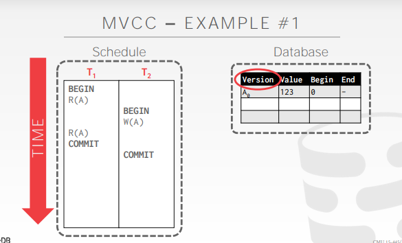
- 此时全局会维护一个txn table（方便互相查明事务的状态）
  - 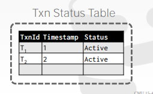
- 此时T1又要去读数据，就得找到当前事务对应的版本读取数据
- 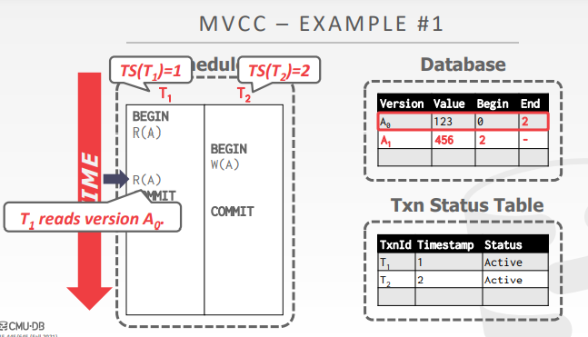

example2（快照隔离）

- 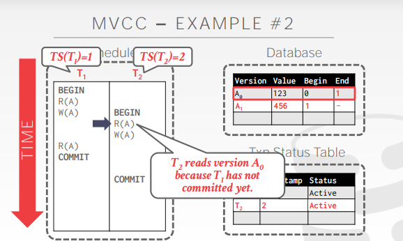
- 探讨一下T2对于数据A的读取：
  - 按照先后顺序，T1发生在T2之前，T2的数据就应该基于T1的操作进行
  - 但如果T1发生了abort，那么T2此时读到的数据就是脏数据
  - 因此mvcc的处理就是让事务二读到的数据是事务一修改之前的（因为认为此时的数据是脏数据，所以就不能读）
  - 其实从这里就可以看出单单mvcc是无法实现串行化的（为了不读到脏数据而做出妥协），但是逻辑上却不符合常理，因为要保证T2读到的是T1处理完的数据，而事实却是读到的是T2时最新版本的数据
- 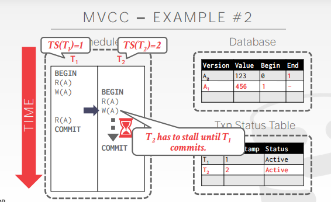
- 探讨一下T2对数据A的写入：
  - 此时T2要修改数据，发现T1有一个未提交的事务数据（即发现了一个未提交的新版本），所以会wait到T1结束，才能继续修改
  - 从事务的顺序来看，T1发生在T2之前，那么T2对数据写的版本必然是最终版本，而在上面这个情况下，如果T2写了新版本的数据，结果T1有重新写了一遍，逻辑上就会出现错误了..，所以T2必须要等到T1commit，才能给数据加上新版本
- 这其实也是**oracle的最高隔离级别快照隔离（snapshot隔离）**，依靠的就是**mvcc**

一些思考

- MVCC不仅仅是并发控制的手段，更是DBMS管理事务的手段（几乎所有的DBMS都实现了mvcc）
- 关于读写冲突
  - 普通2PL，因为有事务A先拿了读锁，以至于另一个事务B拿不了写锁，另一个事务B必须等到事务A放锁了以后，才能继续往下走拿到写锁
  - 而mvcc，事务A读不加锁，直接读，然后事务B写一个新的版本放入storage，接着如果事务A继续读的话，读历史版本即可
  - 由此可见2PL和MVCC都可以解决读写冲突，但mvcc没有锁，没有阻塞，提高了效率和并发度
  - 同理MVCC也能解决写读冲突

- 而写写冲突mvcc无法解决，所以引入S2PL，即在写的时候上锁
  - 这里是指mvcc无法解决写写冲突，是因为下图：
  - 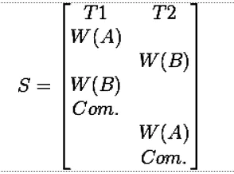
  - 如果只用mvcc，那么造成的结果就是数据A就是T2的版本，数据B就是T1的版本，那么数据的一致性就会出问题
  - 所以必须要用2PL来解决（要上锁，PS：不过这里会造成死锁，那么就需要abort之类的解决方案了）

# concurrency control protocol

- 只使用mvcc无法实现可串行化的，所以一般都是结合其他方法实现并发的，比如说TO，OCC，2PL
- 其实我有一个问题，其实2PL、严格2PL + 间隙锁就可以实现很多的隔离级别，为什么还需要mvcc
  - 我觉得的一个解释就是，使用mvcc可以提高并发度，即一定程度的不阻塞读（依靠的就是本地保留这个数据）
  - 即2PL其实是可以实现的，但是会减损一些并发度，所以要使用mvcc（使得原本的范围变得宽松而合理一些）
  - 从另一个角度说，mvcc需要2PL，也是因为单靠mvcc无法实现串行化（比如mvcc就无法解决写写冲突）

# version storage

- 数据的不同版本是如何存储的
- DBMS会用一个指针指向当前最新的数据吗，会在数据库里面建立一个版本的链表，记录版本号（在链表上寻找版本）

## append only storage

- 数据库中的记录每次更新，都将在main table中添加一个新的版本，通过指针将不同的版本记录链接起来，组成版本链
- 所有版本（无论新旧）数据都放入一个main table中
  - 每一行的每一个版本都在同一个数据表里面，就打比方说数据库里面存了十条记录，但其实这个main table存了比十条数据更多的数据，因为要存储每个历史的版本，即这个main table存储的是databese中数据所有的历史版本

- 如果要修改数据的话，其实相当于往数据表里面追加了一条数据
  - 对于一条要新追加的记录，首先插入一条新的数据记录，然后找到此时除去当前记录外最新的版本，将该版本的指针指向这个新的数据记录
- 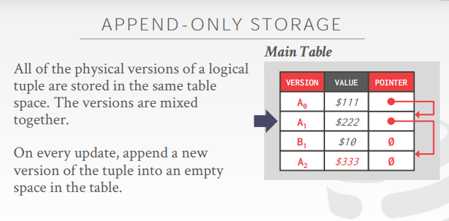

链表的两种实现思路

- 

- 第一种是将新的数据追加到链表后面（Oldest-to-Newest）
  - 生成新版本时，将老版本的指针指向新版本，所以访问如果要访问最新记录，需要遍历老记录，因此会造成读放大，
- 第二种是将新的数据追加到链表前面（Newest-to-Oldest）
  - 生成新版本时，将新版本的指针指向老版本，所以访问某个版本的记录时，需要从新记录开始遍历到指定版本
- 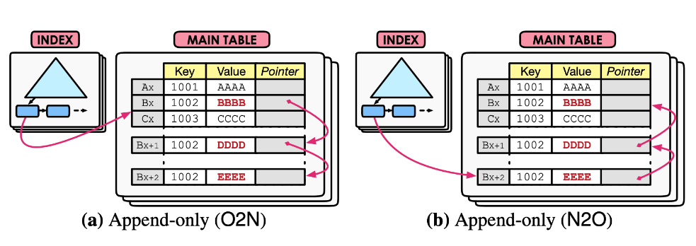

## time-travel storage

- 
- main table存储的是当前最新的数据，time-travel table存储的是历史的数据
  - table的组成是version号，数据本身和指向数据的指针
  - main table的value是最新的数据，指针则指向time-travel table上的历史数据（因为历史数据必然都放在time-travel table中）
  - 这里的value存的是每个修改了的行的行数据
- 插入数据：将老版本直接copy到time-travel表，新版本写入main table，新版本的指针指向老版本
- 数据回滚：通过主表中最新版本的指针去遍历老版本
- 如果总共有十行记录，那么main table就只有十行记录的最新版本，而time-travle table中就可能会存放很多的历史版本（这些历史版本都用链表连在一起）
- time-travel也是append-only的存储方式，只是新老版本在不同的表空间中。这种方式有利于回收老版本记录，但同时产生了写放大
- 

## delta storage

- 增量存储，将每次发生了修改的数据部分存储到delta storage segment中
- 背景：发现time-travel把整个行记录都存下来，是有点浪费的，所以每次都存储增量即可
- 一个表存储的原数据，另一个表存储的时每次修改的增量
  - 而这里的delta存储的是每次具体修改了哪些部分
  - 
  
- 
- 如果想要看历史版本，就要调用delta storage segment中的记录逐步回滚
- mysql就是这么做的，不过mysql存储的是undo段
- 优点：可以节约历史版本大小
- 缺点：回滚很麻烦，即恢复的时候需要逐步读delat storage segment去回滚

# garbage collection

背景

- 不可能无限存储历史的版本，所以要删除掉一些历史版本

回收的宗旨

- 如果任何活着的事务都看不到这个版本了，那么这个版本就直接删掉了（如果有一个事务的版本是1，但当前活着的事务的版本都是10以上的，那么事务1的版本就可以删除了）
  - 在快照版本，如果所有的事务都不要他了，就要把它删掉
- 如果一个事务发生了abort，就删掉版本

实现的难题

- 如何发现这些版本
- 什么时候删掉历史版本

## tuple level

- 以元组为粒度进行回收过期记录
- 遍历行记录，寻找哪些没有用的行记录

方法一：background vacuuming

- 用一个后台的线程对当前发生的事务和历史版本进行扫描对比，如果有数据的版本是小于当前所有的活跃事务的版本，就要清理掉
- 优化：
  - 当前的线程会对所有的数据进行扫描，极其浪费时间
  - 而如果当前的数据页被更新过了就标记一下，后续就扫描那些被标记过的数据页即可，而不是全表扫描，就可以提高性能
- 

方法二：cooperative cleaning

- 合作清理
- 执行事务的语句在检索版本的时候顺便查看一下，有哪些版本是没有用的，顺便就把没用的数据给删除掉即可
- .png)

## transaction-level

- 以事务为单位，清理掉老事务的数据版本
- 记录历史版本，以事务为单位进行回收
- 每个事务记录了当前事务对那些数据进行了读写
- 过了一段时间，DBMS会决定哪些事务的数据版本清理
- 具体操作：
  - 每次修改数据，然后记录修改数据之前的旧版本
  - 然后过一段时间，DBMS决定多少版本号之前的事务都可以干掉了，那么就可以遍历事务，然后把数据的老版本给干掉

# index management

- MVCC下索引的管理
- 主键索引存放的都是物理地址（位于哪一个page的哪一个slot）

- 如果一个事务修改了主键的值，就要把数据先删除，后插入
- 比较麻烦的是辅助索引，所以下面谈到的是辅助索引的两个流派
- 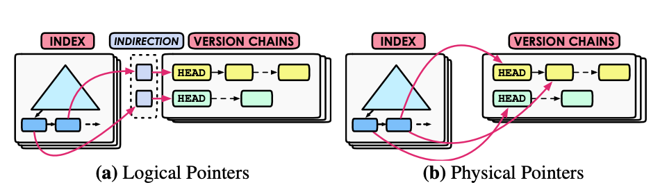

## logical pointers

- 键存储的是被索引的那一列的数据，值记录的是逻辑地址（比如说记录的是主键的值，或者行id的值），即逻辑索引
- 索引指向一个"中间指针"即逻辑指针，这个中间指针再指向主表存储的元组的位置(某个页面的某个位置)
- 优点：
  - 如果数据发生了更新，那么只需要修改主键索引的地址（因为辅助索引指向的是主键索引的位置）
  - 这种方式对于写比较友好，例如，如果更新某条记录，则这条记录相关的所有索引都不需要更新，只需要更新"中间指针"指向新的元组的位置即可。

- 缺点：
  - 但是存在读放大问题，所有索引访问数据都需要先访问"中间指针"，再跳转到实际数据存储位置

- MySQL InnoDB就是使用逻辑指针的方式，所有索引都指向主键，通过主键再去访问真实的数据

## physical pointers

- 记录的是物理索引（索引都指向主表存储的元组的真实位置）
- 优点：
  - 对于读比较友好，索引指向元组的实际位置，直接就可以访问到元组，无需通过中间指针进行跳转（不需要回表）

- 缺点：
  - 如果辅助索引记录的是数据记录的物理地址，那么当有新的版本数据到来的时候，所有的数据记录都要修改
  - 并且，如果有多个辅助索引，那么复杂度会非常的夸张
  - 但不利于写，如果更新了某条记录的位置，则相关的索引都需要更新，造成写放大

- PostgreSQL使用这种方式，所以更新记录时成本较高

# mvcc index

- index不会保存数据的版本号的

- 但是因为mvcc有快照，所以索引需要保存冗余的数据
- 为什么要存储冗余的数据
  - T1第一次读数据A，而TB修改了数据A后又删除了数据A，此时T3又在原来的位置插入了新的数据A
  - 问题来了，事务3插入数据的时候又形成了新的版本（事务3认为此时没有数据，所以产生的版本号居然和事务A产生的是一样的）很明显应该不是同一个版本
  - 所以就需要存储冗余的键值，以维护隔离级别（比如此时的数据A就要维护T1指向的A1的版本和T3指向A1的版本）
  - 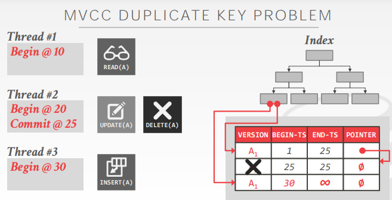
- 而每个索引的位置维护了多个值，所以需要额外的逻辑去维护唯一键值等关系

# mvcc deletes

- DBMS真正在物理上将数据从数据库中删除，只有当该数据的所有版本在逻辑上被删除，即逻辑上该数据的所有版本都没有用的时候，才会将数据真正删除
  - 换言之，一般数据的删除，我们都要保留一下数据的版本

- 需要一些方法来查看数据是否在逻辑上被删除

## deleted flag

- 在每个行记录上加上一个列，代表该数据是被删掉了的

## tombstone tuple

- 给这个行记录添加一个新的版本，相当于是一个墓碑，代表从这个版本以前这个版本是被删掉的
- 这个墓碑之后新的版本，是重新插入的

# mvcc implementations

- 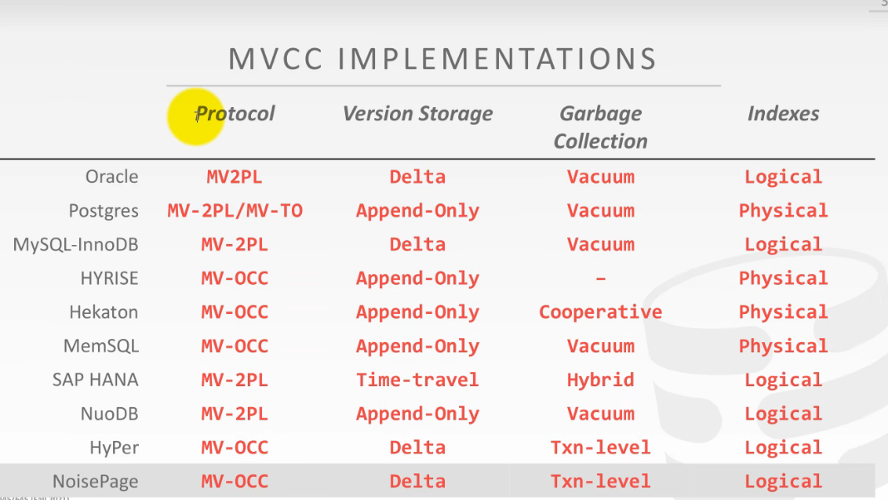
- 关键点：protocol（mvcc和什么手段结合），version storage（版本管理，版本存储的方案），garbage collection（垃圾回收），辅助索引（是logical还是physical的）

# conclusion

mvcc + 2pl实现数据库隔离级别

- 读未提交：感觉是mvcc和2pl都不用了（因为mvcc天生就不能读到未提交的数据）
- 读已提交：mvcc，每次读的时候都重新查看一遍快照，读取最新的已提交的数据
- 可重复读：mvcc，第一次执行读操作的时候生成snapshot，后面都读这个snapshot（如果是`SELECT ... FOR UPDATE`或DML语句，需要用排它锁锁住需要读写操作的数据直到数据结束）
- 串行化：直接S2PL，严格二阶段锁即可