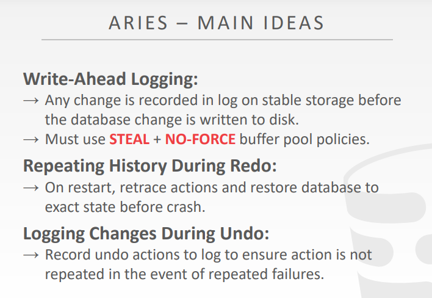
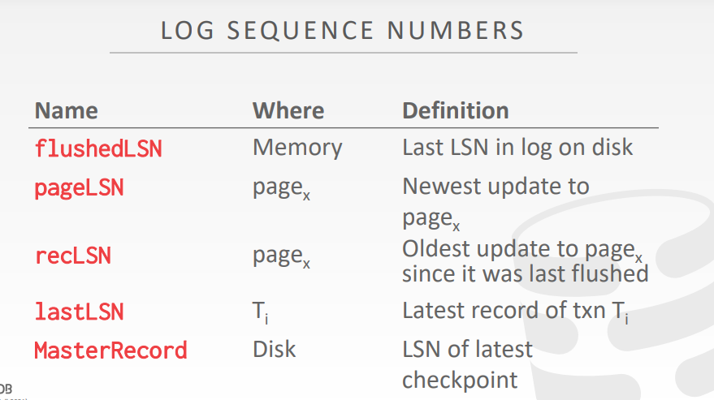

# Crash Recovery

故障恢复算法是为了确保**数据库一致性**，**事务的原子性**和面对故障时**数据的持久性**的一种技术

 

故障恢复算法主要分为两部分：

第一部分：在正常的事务处理阶段添加一些操作，使得DBMS可以在故障发生时对数据进行恢复（防患于未然）

- 通过上一章的学习，发现添加的操作主要就是WAL

第二部分：在数据库故障发生时执行一些操作，以此维护数据库的原子性、一致性和持久性（利用上一个部分所添加的操作，维护DBMS的ACID特性;**本章的重点**）

 

 

 

 

# Checkpoints

崩溃恢复时，可以直接从checkpoint的位置开始读取数据，而不用将所有的log都读取一遍

checkpoint会周期性执行

 

 

checkpoint会将内存中的数据（脏页）和日志全部都写入磁盘

然后，会在日志中会写入一个checkpoint的标志

 

 

## Example

 

checkpoint之上的日志和数据页，都已经被写入磁盘中了

checkpoint之下的日志和数据页，还在内存中

此时发生了crash，便有如下分析过程：

事务T1的开始和结束都是在checkpoint之上的（表示其中的数据都写入了磁盘中），因此DBMS不需要对其进行恢复

事务T2的开始是在checkpoint之前，结束是在checkpoint之后（但是T2的commit的日志已经在磁盘上了，表明该事务已经提交了），因此，T2需要进行redo操作，将checkpoint到T2 commit之间的，属于T2的操作全部重现一次，从而实现事务的原子性

事务T3的开始是在checkpoint之前，但在磁盘上的log中没有发现T3 commit的日志，因此需要undo操作，将此前T3的相关操作全部都给回滚

 

 

 

# ARIES

全程是Algorithms for Recovery and Isolation Exploiting Semantics

从字面的意思理解就是数据库恢复原型算法

原型是指这种算法的理念各大厂商都有去实现和遵守，但是工程细节上面又会有所不同，并且不同厂商也会有所创新

 

 

## Main ideas

**WAL**：使用的是`steal + no-force`策略，数据页可以不立刻写入磁盘，但是日志页必须立即写入磁盘

**Repeating History During Redo**：在DBMS崩溃的时候，要使用WAL的日志对数据进行恢复

**Logging Changes During Undo**：日志中虽然记录了一些操作，但是直到DBMS崩溃的时候该事务还没有提交，那么这些执行了一半的事务，操作过的数据都需要撤销回滚

 

 

 

# Log Sequence Numbers

背景：

需要给每一条日志一个单调递增的，全局的序列号

序列号的作用是表明系统当前运行的状态

 

 

**flushedLSN**

该LSN是存放在内存中

记录的是上一次刷到磁盘上的log的编号

换言之，现在有哪些日志是已经被写入到磁盘上了的

比如说，如果此时的LSN是100的话，就代表前100号日志都已经落到了磁盘上

而在100之后的日志就还没有写入到磁盘中，即还在内存中

 

**pageLSN**

该LSN是存放在数据页上的，每一个数据页都有一个pageLSN

记录的是最近一次，修改当前数据页的日志的编号（LSN）

也可以认为是当前数据页在内存中时，最新修改该page的日志的编号

 

**recLSN**

该LSN是存放在数据页上的，每一个数据页都有一个recLSN

记录的是，当前的page在上一次写入磁盘后，第一个对该page进行修改的日志编号（LSN）

可以理解为，比当前磁盘上的page还要新的第一个版本

或者说，记录的是内存中当前page最早的修改（在此前，更早的修改都已经落盘了）

因此，关于当前在内存中的page，recLSN到pageLSN之间的日志修改，都存储在了内存中

recLSN和pageLSN在内存中，对于当前page的修改的上限和下限

 

**lastLSN**

该LSN是针对单个事务的，每个事务都有一个lastLSN

记录的是，当前事务最后一条操作日志

 

**MasterRecord**

该MasterRecord是针对全体存储介质的，每个存储介质（例如磁盘）都有一个MasterRecord

记录的是上一次标记，带有checkpoint点的日志的LSN

 

 

## Writing log records

始终遵守的一个原则：当一个脏页X被刷到磁盘的时候，必须要保证pageLSN~X~小于等于flushedLSN

这就意味着，写入脏页X的前提是与脏页有关的日志及当前日志之前的所有日志都得写入磁盘中

 

所以，如果我们想要将脏页X写入到磁盘中，至少需要将脏页X的pageLSN~X~前面，已经操作过的数据写入磁盘

然后才能将脏页X写入磁盘

 

每一个log都有其对应的LSN

每当事务修改page上的数据的时候，都要更新pageLSN

每一次将内存上的日志写入到磁盘时，都需要更新flushedLSN

 

 

 

# 31min

# Normal commit & Abort operations

## Normal execution

事务的组成：对数据的读写操作、事务的开始标记、事务的commit以及abort

并且，对于事务的操作简化为以下模型：

- 所有的日志记录都保存在同一个page中
- 磁盘的写入都是原子操作
- 以SS2PL为背景，研究事务的恢复机制
- steal + no-force的方式管理缓冲池

 

 

## Transtion commit

当事务在commit以后，内存中的脏页并不会立刻写入磁盘，而是会在后续才把数据刷盘到磁盘中

所以，当数据真正刷到磁盘中的时候，log中会添加一个txn-end的标志（对于用户来说是未知的）

即commit仅代表日志进了磁盘，但是实际上数据的修改是没有落盘的

 

 

## Transtion abort

prevLSN 加在每一条日志后面（作用：记录当前日志的上一条日志是几号）

- 因为LSN是所有的事务共同使用的，即存在说15号日志的上一条日志14号日志，是其他事务的日志
- 即prevLSN是为了找到当前事务当前日志记录的前一条日志是多少号

CLR类型日志

- 如果需要回滚日志，那么回滚过程中就插入一条CLR-00x日志，即撤销掉00x号日志（用于将数据回滚到对应原值）
- 其中的undonext值是指要继续往上撤回的日志LSN是多少
- 注意，TXN-END也可以用来表示日志的回滚结束

回滚的具体操作

- 首先要写一个abort的record在log中
- 然后就要撤销该事务所有的update（反向撤销）
- 每次回滚掉一条日志的时候就要加上一条CLR日志，然后再恢复旧的数据
- 全部回滚了以后，要加上一条txn-end日志
- PS：清理日志是不需要被回滚的

 

 

 

# Fuzzy checkpointing

未优化的checkpoint

- 开始checkpoint的时候，要让所有新的事务停止
- 需要把正在进行的事务做完（如果有些事务要执行非常久，就会浪费时间）

slightly better checkpoints

- 不要让所有正在进行的事务结束，而是让他们停下（即让那些需要被刷盘的数据加锁，让那些进行的事务不能修改被刷盘的数据）
- 即将那些正在进行checkpoint的数据加锁，让事务无法对其进行修改

active transaction table

- 活动事务表：记录了做checkpoint的时候，内存中活动的事务
- 组成：
  - 事务ID（txnID）
  - 事务的状态（txn status）（R：running，C：committing，U：还没提交）
  - lastLSN（事务最近的一条日志）

dirty page table

- 记录了recLSN（第一个让这个页变脏的日志，即上次刷盘之后开始的第一个日志）
- 即记录checkpoint此时内存中的脏页

slightly better checkpoint允许不清空所有的事务，也不刷脏页，而是记录下此时的事务和脏页

缺点：尽管没有清空事务，但是还是暂停了事务

fuzzy checkpoint

- 将checkpoint由时间点变为了时间段
- 记录checkpoint-begin和checkpoint-end
- 在checkpoint-begin以前提交的事务的日志及数据都已经刷盘，而未提交的事务则会被记作脏页放在checkpoint-end后面的dirty-table中

 

 

 

# Recovery algorithm

aries算法

analysis阶段

- 数据库宕机后将读入WAL文件，先找到masterrecord，即上一次checkpoint的那个点（如果是fuzzy checkpoint，那就是checkpoint-begin），并对其上下的日志进行分析

redo阶段

- 把应该落到磁盘中，但是还没有落到磁盘中的数据进行回放

undo阶段

- 应该回滚但是还没有回滚的数据进行回滚

分析阶段宕机

- 也没有问题，大不了宕机后在分析，反正分析的时候有没有做其他的处理

redo阶段宕机是否有问题

- 没问题，因为redo阶段的数据都是在内存中进行处理的

 

 

 

# Conclusion

些许思考

- 刚才还在想写日志是顺序io（后续特定时机在刷盘），那么用日志是不是就比原来高效
- 其实这里不好说，因为如果不用日志，那么就是直接刷盘，在执行语句的时候性能会受到影响；对比使用日志进行顺序IO来说，执行语句的时候是顺序IO，性能不错，但是后续还是要刷盘的
- 所以，我想说的其实是日志的目的不应该是为了提高执行语句的时候的性能，更加准确的应该是起到崩溃恢复的作用，起到一种对用户的约定（提供ACID的服务）