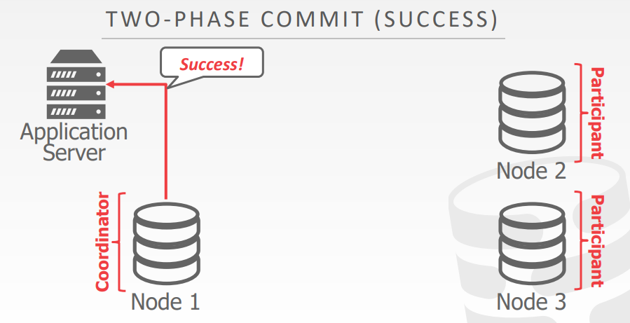
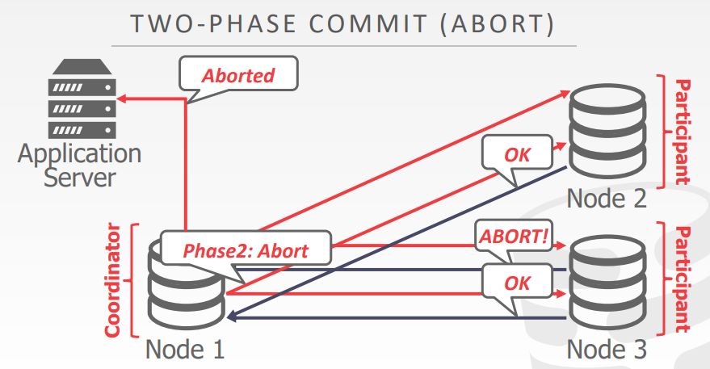

# OLTP vs OLAP

## On-line transaction processing（OLTP）

事务的流程较短、语句较少、涉及数据的读写操作（可能写数据的情况会多一些）

一般来说，每个事务对整体数据的影响都很小

存在大量重复性的小事务

 

 

## On-line analytical processing（OLAP）

事务的流程较长、语句较多、大部分是只读操作

语句中有非常复杂的join操作

大部分用于数据分析的场景

 

 

 

# Decentralized coordinator

中心化的协调思想

应用先向主节点（primary node）发送事务开始的请求（begin request）

 

然后，应用可以去各个节点对数据进行查询

 

当事务结束以后，应用需要再给主节点（primary node）发送一个commit request的请求

主节点（primary node）需要去各个节点判断，事务是否可以在本节点上安全的提交

 

 

## Observation

但，这种场景下没有讨论如何确保所有的节点都能够成功的提交事务

比如说：

如果单个副节点的提交失败了，该如何处理？

节点直接的通信发生了严重的延迟，该如何处理？（rpc调用延迟过长）

不想等待所有的节点都同意再提交，该怎么处理？（可能有些节点需要很长时间才能够将事务提交）

 

 

 

# Important assumption

数据节点分布在全世界，而这里要假设每个节点的DBMS是正常工作的（是善意的），是可控的（是在可以管理的情况下的）

也就是说，数据节点不会被黑客攻击

 

因此，这里的分布式数据库是暂时不考虑**拜占庭问题**

 

PS：类似区块链这种场景，可以理解为是一个分布式数据库

但是每个节点的信息是不可靠的（因为每个节点都是由不同的人或机构组成的，互相之间是不可信的）

因此在区块链的场景下，需要更加复杂的共识算法去实现共识机制，去解决拜占庭问题

 

 

 

# Atomic commit protocol

当一个多节点事务完成后，DBMS需要了解各个节点是否都是安全可提交的

因此为了实现分布式数据库中的原子提交，可以使用以下协议去实现：

 

 

## Two-phase commit

2PC分为两个部分：**准备阶段**（prepare）和**提交阶段**（commit）

 

 

### Prepare

首先接收到应用commit request的节点会变为协调者（coordinator）

而其他的节点会变为参与者（participant）

协调者首先会向参与者发送确认请求，让参与者确认本次事务的修改是否是合理正确的

如果是，就会回复ok

 

 

但如果不是，那么参与者（participant）就会回复abort，并进入abort阶段

 

 

### Commit

在收到参与者的回复（ok）之后，协调者就明白当前事务在其他各个节点上都是安全可提交的

接着进入commit阶段

此时协调者会再向参与者发送一个commit请求，参与者就会在本地提交当前的事务

提交成功后会回复ok

 

 

最后事务就算是提交成功了，并给应用层返回信息

 

 

### Abort

进入abort阶段后，协调者会发送abort请求给参与者

告知参与者事务需要取消回滚

参与者回复ok之后，协调者就会给应用层返回abort请求

 

 

### Optimizations

2PC的两个优化方向

**Early prepare voting**

如果已知某个查询语句是事务中的最后一个语句，那么就可以将这个语句和commit request一并发送给coordinator协调者

而不是将语句和commit request分开发送

一并发送可以提前开始投票，即提前开始prepare阶段

 

**Early acknowledgement after prepare**

在prepare阶段收到所有节点的同意的时候，就可以提前告知用户事务commit success

而不是等到commit阶段结束后再告诉用户

但是这种方法也有缺点，比如说返回成功以后集群断电了，就可能造成数据的丢失

 

 

### question

如果2PC过程中，协调者发生了崩溃，那么参与者该如何处理？

答：有可能此时参与者还在执行着一部分事务，所以此时需要参与者将事务进行回滚

 

如果2PC过程中，参与者发生了崩溃，那么协调者该如何处理？

答：那么此时，协调者会认为该参与者是不同意该事务的发生的，默认它返回的是abort

 

 

## Paxos

Paxos或Raft，其实本质上是一个**共识机制**，或者是一个**一致性协议**

通过投票机制，取得大部分人的共识，选出一个大部分人都认可的决策

如果一个集群中大部分的参与者（都是正常可用的）都同意某个决定，那么全体成员就都需要执行这个决定

 

 

### 单个事务的Paxos

在Paxos中，分为提议人（proposer）和接收者（Acceptor）

收到应用commit request的就是提议人

首先，proposer收到应用的commit request，系统就会进入propose阶段

proposer会提出提案，即要将当前的事务提交

acceptor就会评估proposer给出的提案是否可以提交，如果能够提交，就会回复一个agree

 

 

在收到acceptor的回复以后，如果有超过一般的acceptor都同意这个提案

接下来就会进入commit阶段，

proposer会发指令让所有的acceptor都同意这个提案

最后，acceptor执行完之后，会再给proposer发送一个accept

 

 

面对那些处于崩溃状态的节点（即acceptor），proposer会持续不断地向其发送信息

直到该节点接受这条信息

 

 

### 多个事务的Paxos

一开始进来的是事务n，此时的事务n完成了propose阶段

而此时又来了一个事务n+1，开始了它的第一阶段propose

而Paxos为了要实现可串行化，因此就会要将原来的事务n给拒绝掉

所以acceptors就会给事务n的proposer一个reject

然后继续原来事务n+1的流程

 

 

其实Paxos更多的是做副本分发的一致性，用于做事务的协调是很少的（基本没有）

 

 

## Multi-paxos

如果系统内部可以选举出一个单独的proposer，相比Paxos，那么就可以跳过Propose的过程

缺点是如果这个proposer挂了的话，就会导致系统的崩溃

因此，为了维护这个proposer，系统会周期性的维护这个proposer，即每隔一段时间就会选举出一个新的proposer

这种隔一段时间选取出一个新的leader的机制在Raft中名为**租约**

 

 

## 2PC vs Paxos

在2PC，如果协调者或是接受者宕机了，整个系统都会无法运作

在Paxos，只要大多数的参与节点不会宕机（指一半），系统都是可以运作的

 

 

# Replication

## Replica configurations

副本的架构

 

 

### Primary-replica

主备模式

对于数据的操作，一般都需要在主节点上操作

主节点可以在没有原子提交的情况下（指可以只在主节点上操作，而不用上述的多节点原子提交），通过log的方式将数据分发给备节点

对于只读操作，可以在备节点中进行

如果主节点崩溃了，那么就会在其余的备节点中选举出一个新的节点

主备模式是副本架构中运用最多的一种方式

 

主节点用于数据的读写

备节点用于做数据的备份、主节点崩溃时选取备节点当主节点、当需要查看线上数据的时候可以用备节点查看

比如说一些小公司，对于数据的分析，很多都是读取备节点上的数据

 

 

### Multi-primary

多主模式

任何一个节点都是主节点，因此对于数据的操作可以在任何一个节点上执行

也正因如此，多个主节点之间需要频繁的同步数据，尤其是出现矛盾的时候，更加难以处理

即，需要原子提交协议的支持（多个主节点，2PC提交）

 

 

 

### K-safety

需要保证线上的数据始终保持至少有k份

可以理解为这个叫作安全度，也就是说如果线上的数据数量少于这个，就不能够对外提供服务

比如说主备模式中，要始终保持线上的数据有2份

如果少于2份，就必须停止服务（这里可以理解为此时只有1份了，即主节点的数据，那么备节点就没有数据了，相当于备份失效）

 

 

## Propagation scheme

主节点的数据如何同步到其他节点上

 

### Synchronous

同步（强一致性）

当向主节点提交数据的时候，系统会强制将此时的数据同步到其他节点上（因此会造成延迟）

只有主节点和副节点都提交成功了以后，才会返回给用户（不仅仅是日志要到副节点上，而且副节点还要执行完这个日志才返回）

一般主节点使用log与副节点进行同步（比如mysql的binlog）

缺点：慢，需要多个节点一起同步

 

 

### Asynchronous

异步（最终一致性）

当主节点操作完数据以后，便立刻返回给用户，表示数据的操作成功了

将数据同步到备节点上的操作，后续再执行

缺点：如果后续数据同步的过程中，DBMS宕机了，就会造成数据的丢失

 

 

Mysql使用的是半同步半异步的方案：

主节点将日志传给备节点，然后当日志传输成功了以后，就返回给主节点，留着备节点慢慢执行

 

 

## Propagation timing

数据传输的时机问题

### Continuous

主节点不断地将数据传播给备节点，用户发一条SQL，主节点就发一条SQL给备节点

最后还需要将commit/abort的信息发送给备节点

缺点：如果发生了回滚，那么主备节点都需要一起回滚，很麻烦

 

 

### On commit

平常的时候不会将操作SQL传给备节点

只有事务真正提交的时候，才会将SQL传给备节点

优点：回滚上不会有很大问题；不会浪费时间在发送失败事务的日志记录上

缺点：最后事务提交的时候，需要发送日志，存在时间上的开销

并且，如果事务的SQL太多的话，主节点本地就需要存储大量的日志，浪费空间

 

 

## Active vs Passive

### Active-active

主备同步的时候，主节点传递的是SQL，因此SQL还需要在备节点上再执行一遍

即SQL需要在每个节点上单独执行一遍

最后，还要检查事务是否在每个副本中都得到了相同的结果

缺点：SQL会被不同的节点重复执行

 

 

### Active-Passive

主备同步的时候，主节点先将SQL执行一遍

记录到底需要修改哪些数据，并记录成日志

然后再将日志传递给备节点

 

 

PS：此前说的数据，都是数据未分片的例子

而实际上，此前的做法也是可以用于数据分片的情况的

比如说主备模式，

节点A可以做数据1的主数据库、数据2的备数据库

节点B可以做数据2的备数据库、数据1的备数据库

那么操作数据1的时候，就得用节点A，然后同步到节点B

操作数据2的时候，就得用节点B，然后同步到节点A

 

 

 

# Consistency issues（CAP）

`consistent`（**一致性**；也就是线性一致性）

`always available`（**高可用**；即使部分节点崩溃，也能对外提供服务）

`network partition tolerant`（**网络分区容忍**；如果一个集群因为网络的断开，会不会因此变为两个集群）

这三者是永远都不可能同时实现的，最多同时实现其中的两点

 

 

## Consistency

这里的一致性是**强一致性**

即**一旦数据写入到了系统中，就能够立刻在任何一个节点上读到这个数据**

 

 

## Availability

高可用性

如果集群中的某个节点崩溃了，那么其他的应用节点依旧能够对外提供服务

比如说这里的备用节点，在没崩溃之前都是访问备用节点的

备用节点崩溃后，应用可以访问主节点，应用层面不受影响

 

 

## Partition tolerance

分区容忍性

两个交流的集群发生了网络切断，造成了网络分区

即每一方都认为自己没挂，是对方挂了，那么就会造成备份节点也成为了主节点的角色

 

那么此时，如果两个应用各自向主节点Primary提交修改相同数据的事务

因为都是主节点，所以修改是可以成功的，即可用性得到解决，但是一致性上却无法同步

 

 

## CAP for OLTP DBMS

对于传统型数据库，或者是newSQL型数据库：

如果崩溃的节点数量达到一定的阈值，那么整个数据库就会直接下线，不对外提供服务

即**牺牲可用性，以此保证一致性和分区容忍性**

 

但是对于一些NoSQL型数据库来说，会在分裂的集群重新连接以后

判断那些不一致的数据，选取其中一部分并保留下来

 

 

 

# Federated databases

背景：

此前都假设分布式系统中的节点运行的都是相同的DBMS

但实际中可能是多种不同的DBMS同时使用

因此引入联邦数据库

 

将多个DBMS连接在同一个分布式架构中，是一件非常困难的事情：

- 不同数据库的数据模型不同，同时也受查询语言的限制（SQL其实并不统一）
- 很难去实现查询的优化
- 大量的数据复制

 

 

一种较为好的方案就是利用PostgreSQL，Pg可以存储不同的数据模型

利用Pg作为中间件（服务端），连接各个数据库

 

 

还有一个在国内实践上比较多的就是：

因为国内很多企业用的都是MySQL

而很多数据库都可以识别MySQL的log（比如flink、spark）

那么可以让一些其他种类的数据库作为备节点，让MySQL的主节点源源不断的发送log，然后在本地解析它

一个比较常用的场景，日常使用的是TP型数据库，而需要用AP型数据库对数据进行分析

那么就可以让AP型数据库作为备节点，让主节点的TP数据库不断的向它发送日志

另一个场景，就是需要检查某个数据是否发生了变化，那么就可以将将数据同步到其他的DBMS中，实现监听（或者数据库的触发器也是可以的）

 

 

 

# Conclusion

上述的很多方案都是基于数据库节点本身是友好的

而区块链数据库都假设每个节点都是恶意的、都是对抗性极大的

因此需要使用更加复杂的协议来提交事务，以此实现DBMS的正确运行（比如工作量证明等）