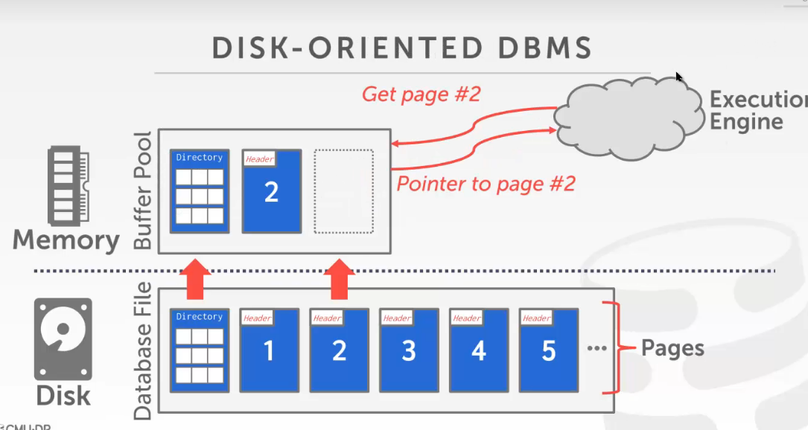
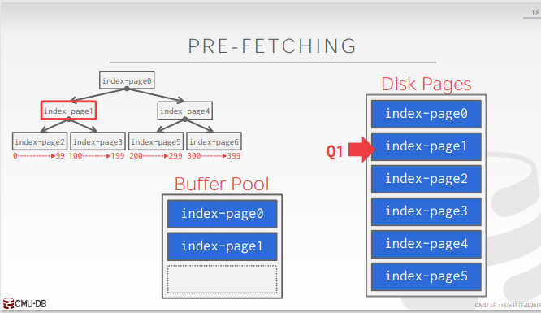
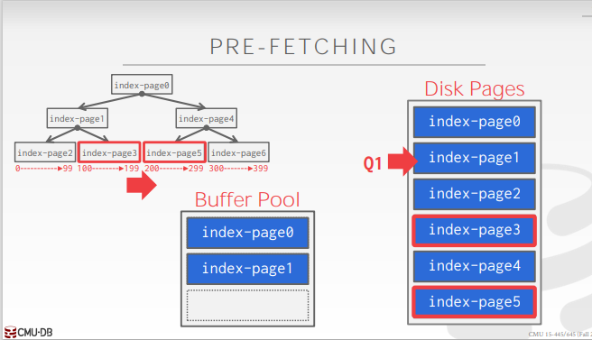

# background

- 在内存中开辟一个区域存储数据，缓存数据库文件的数据页
- 研究数据库存储的第二个问题：DBMS如何管理数据在内存和磁盘上来回移动数据
- 为什么要在内存中缓存数据，因为随后可能用户还要再访问相同的数据
- 用户如果修改了一些数据，如果没有保存，就会在内存中
  - 用户如果crud了一些数据，首先是放在内存的缓存池的（如果马上读写硬盘，就会发生频繁的停顿，性能会非常的差）
  - 所以要研究缓存的策略
- 则缓存池的两大作用：缓存用户插入修改后的数据，同时找个时机刷盘，即异步的刷盘 ；缓存原数据，以便用户查询
- 两大控制
  - spatial control：空间上的策略，要把用户经常用到的数据都放在一起，用户用的时候就可以直接从缓存池拿即可；确定数据存储的位置；目标是将用户会经常用到的数据
  - temporal control：时间上的策略，什么时候把磁盘上的数据页读到内存中，又什么时候把用户的数据刷盘；目标就是要最大限度的减少用户再存取磁盘的等待（即不要更新数据了就立马刷盘，不要让用户等太久；或者说预读一些用户会用到的数据，当然这是最好的办法）
- 
- 面向磁盘存储的DBMS的结构
  - 数据非常的多，所以要把它们切成不同的页
  - 内存比磁盘要小得多，但是读取速度非常快
  - DBMS读取数据，首先先去memory中查找，如果没有的话，就加载磁盘中的数据页，把它读进来
  - 
  - 所以硬盘的作用就是将数据从disk读到memory中
- 为什么不用OS的bufferpool：
  - 但是此种方式性能会比较差，这是由于数据库系统和操作系统/文件系统是隔离的，OS与FS在缺少信息的情况下无法采用高级的算法来改进数据库系统的性能

# locks vs latches

locks

- 保护数据库的逻辑内容不受其他事务的影响
- 在事务持续时间内保持
- 需要能够回滚更改

latches

- 保护DBMS内部数据结构的关键部分不受其他线程的影响
- 在操作持续时间内保持
- 不需要能够回滚更改
- 有点类似std::mutex
- 可以理解为就是平常数据结构中要用到的锁

# page table vs page directory

page directory

- 比如磁盘中就有一个page directory，记录了数据页位于磁盘的那个位置
- 记录的大概是每个page的id和page具体存储在磁盘的那个位置，这两之间的映射

page table

- 是指内存池里面的页在哪里
- 记录的是每个page的id和page具体存储在buffer pool 的哪个frame帧上面

# allocation policies

- 内存分配策略，即从磁盘获取的数据页，要缓存到那里

- 全局策略
  - 为全局活跃的事务做决策
  - 将全局的数据页，所有的事务需要的数据页统一的存放
- 局部策略
  - 为一个每个事务分配特定的帧而不考虑事务的并发行为
  - 仍然需要共享页面
  - 本地策略，为每一个事务所需的缓存页，提供单独的策略

# buffer pool optimizations

- 缓存池有哪些策略可以提高性能

## multiple buffer pools

- 多个缓冲池实例
- 背景：数据库的数据页的用途是不同的，比如说有些页是存储索引的，有些页是存储数据的
- 所以，存索引的页有专门的缓冲池，存数据的页也有专门的缓冲池
- 或者说每一个数据库给一个缓存池
- 可以降低锁的冲突（因为当有多个线程对pool操作时要上锁，如果只有一个pool的话锁的竞争就会很大，而分为多个缓冲池可以降低锁的竞争）

## pre-fetching

- 提前读取数据

- DBMS还可以根据查询计划预取页面
  - 顺序扫描
  - 索引扫描
- 如果我们知道DBMS要顺序遍历一遍所有的数据，那么就可以预先将要读到的数据放到缓存池中（顺序扫描的话就是预先读取下一个数据；索引扫描的话就是读取下一个索引页）
- 在查询当前页面的时候，猜测下一个有可能读取的页面，然后将其加入到缓冲池中
- 
- 
- 所以DBMS会猜测下一个要取值的页面是page3或者page5

## scan sharing

- 共享扫描，如果两个sql语句都读同一个表，那就可以做同步扫描
  - 如果两个相同的查询先后到达，那么后面的查询可以先跟着已经进行了的前面的查询一起遍历page
- 查询可以复用从存储或者运算符计算中检索的数据
- 允许在扫描表的单个游标上附加多个查询
  - 查询不必相同
  - 中间结果可以分享
- 如果一个查询开始扫描，并且已经有一个这样做了，那么DBMS将附加到第二个查询的游标
  - DBMS跟踪第二个查询与第一个查询连接的位置，以便当它到达数据结构的末尾时能够完成扫描
  - 比如说一号语句在执行对val的sum，执行到一半的时候，来了二号语句要执行avg(val)，如果不优化的话就又要从头开始遍历，而有了scan sharing之后，就可以接着上面的一号语句也执行到一半，接着一号语句执行完了，二号语句就会从头开始执行，一直到与一号位置相遇的地点
  - 好处就是能够提高IO的复用率（比如说一二号相遇后的数据可能要被读两次，而现在只需要读一次就好了）
- 总结：
  - 如果大家都需要共同的数据，第一个查询和第二个查询都要查询共同的数据，那么就可以让后面的查询先跟着前面的查询，当前面的查询结束后，再回到之前没查到的部分继续查询
  - 这样就可以提高查询效率，即复用后一个查询的IO顺序，通过共用数据来提高效率

## buffer pool bypass

- 将获得到的page数据不存储到buffer pool中
- 因为有些query得到的数据只使用一次，如果放到buffer pool中会导致buffer被污染，间接导致缓存池失效
- 因此当前query还可以创建一个临时的buffer
- 比如说sorting，joins的中间结果是不进入内存池的（中间结果可能别的查询根本不用）
- 在很多数据库里面叫作light scans，轻扫描

# OS page cache

- 操作系统对我们的文件页也是有缓存的
- 而我们不需要OS对数据进行缓存，因为我们不知道OS对这些数据会采取什么策略，而且和本地的缓存是冗余冲突的（因为OS不知道我们具体的策略是什么）

- 大多数磁盘操作都通过os的api进行
- 所以为了绕过OS的缓存，大多数的dbms都使用直接I/O*（O_DIRECT）
- 什么时候淘汰数据页只有DBMS知道，而OS是不知道的
- 同时，OS也不能优化磁盘IO

# buffer replacement policies

- 缓存的执行策略

- 背景：当DBMS需要释放一个frame为一个新页腾出空间时，它必须决定从缓冲池中清除哪一个页
- 即需要清空一些数据页为新的数据页腾出位置
- 需求：
  - 正确性（不能把正在用的数据页给替换掉）
  - 准确性
  - 速度（响应快）
  - 元数据的开销（缓存数据是需要开销的）

## Least Recently Used

- 维护每个页面最后一次被访问的时间戳
- 当DBMS需要删除一个页面时，选择最古老的时间戳的页面删除（就像手机提醒你有些app好几个月都没有用了）
- 保持页面有序，减少搜索时间

Clock

- lru的一种实现方式

- 一开始每个数据页的ref为0，如果数据页被用上了，就将ref设置为1，表示有人读了数据
- 然后将数据页组织成一个循环缓冲区，中间有一个时针指向数据页，如果被指向的数据页是1，那就修改为0，否则就将页面驱逐（ref=0表示没有任何人要读这个数据）
- 时针在循环缓冲区里一圈一圈的旋转
- 不精确，但是快速且开销比较小

problem

- LRU和CLOCK替换策略容易受到顺序洪泛的影响（sequential flooding）
  - 需求是查询执行顺序扫描，读取每个页面
  - 这会污染缓冲池，让页面读一次就再也不会读了
  - 最近使用的页面实际上是最不需要的页面

## LRU-K

- 是lru的一种改进的机制
- 记录访问这个page的最近k次的访问时间，然后从这几次中发现规律，判断是不是周期性的去读

- 跟踪最后K个引用的历史作为时间戳，并计算后续访问之间的间隔
- DBMS然后使用这段历史来估计该页面下一次被访问的时间

## localization

- 本地化
- 按照事务或者每一条语句去驱逐数据，将和自己相关的数据页清除，保留别人的数据页

- 根据每个事务查询要驱逐的页面，这样可以最大限度减少每次查询堆缓冲池的污染

## priority hints

- DBMS知道查询执行期间每个页面的上下文是什么，可以向缓冲池提供关于页面是否重要的提示
- 即执行引擎给缓存池提供一些信息，让DBMS可以对某些数据页进行保留，可以认为是优先级反转
- 比如说对于数据的插入，根节点的数据页是始终都要缓存在内存中的，所以引擎要告诉缓冲池不要把数据页给丢掉

# Dirty pages

- 之前说的都是如何将数据从磁盘读入内存，这里就是要如何把数据从内存刷盘
- 脏页：在内存的数据和在磁盘的数据是不一致的
- 如果缓冲池中的一个页面不是脏的，就直接将它删除；否则，DBMS必须写回磁盘，以确保它的更改是持久的
- DBMS的权衡：在快速删除和不会再读脏页之间权衡

- 如果一个脏页，很久不用它的话，就可以把它给刷盘
- 但是如果很快就要用上的话，那么最好还是把它留在磁盘中
  - 可能会导致持久化的问题，即如果一个数据页一直被使用着，然后又没有刷盘，万一断电数据就消失了
  - 可以用log来解决，即WAL

刷盘的方式

- 异步刷盘

- DBMS可以定期遍历页表并将脏页写入磁盘
- 当脏页被安全地写入时，DBMS可以清除该页或取消脏页标志（可能以后还有用）的设置
- PS：不能在日志记录被写入之前写入脏页
- 脏页和log要持久化

# other memory pools

- 不光有缓存数据页的pool，还有缓存其他数据页的pool

- 除了和索引之外，DBMS还需要内存
- 这些其他内存池可能并不总是由磁盘支持。依赖于实现
  - sorting join所要用到的buffer
  - 热点数据的缓存（比如说一条sql经常被使用，所以就缓存其结果）
  - 维护缓冲区
  - 日志缓冲区
  - 字典缓存

# conclusion

- DBMS自己处理数据页的缓存是优于OS帮忙处理缓存的，因为DBMS知道到底应该如何处理
- 可以在pool上做一些优化