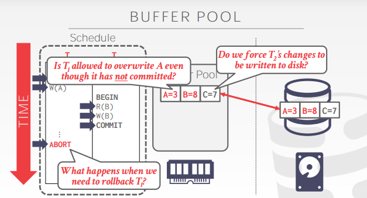
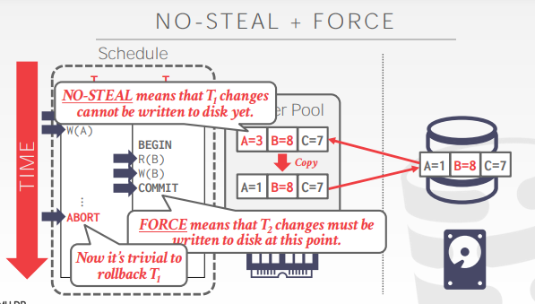
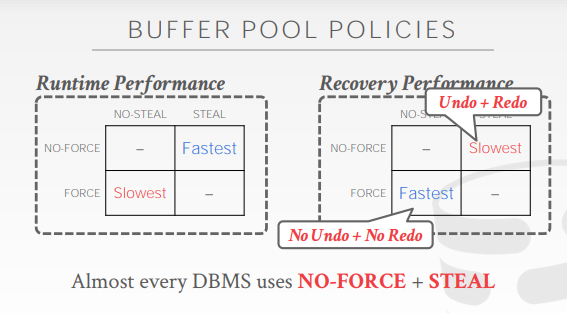
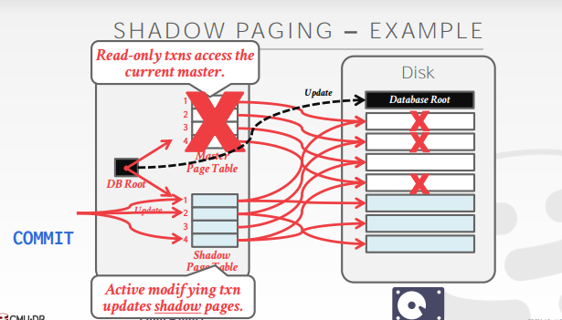
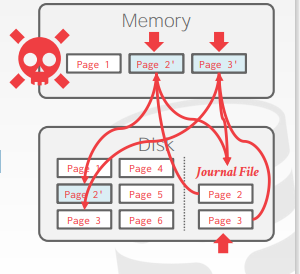
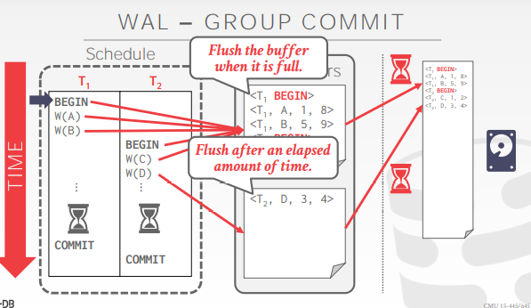
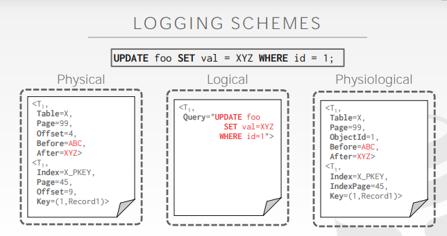

- 回滚做undo的操作（undo往回撤的时候，要把数据恢复成什么，即before）
  - 可以做mvcc的版本控制
- 恢复的时候做redo的操作（数据库恢复的时候，即after）

# 动机

- 因为磁盘和内存访问速度的差异，所以选择的是将数据页先放到内存中进行操作，然后在刷盘到磁盘中
- 可是，如果内存出现了故障，那么内存的数据就会消失，此时该如何处理？

# 故障恢复

- 故障恢复算法是确保数据库一致性，事务的原子性和面对故障时数据的持久性的一种技术

分为两部分

- 第一部分：在正常的事务处理阶段添加某些操作，使得DBMS可以在故障发生时对数据进行恢复
- 第二部分：在数据库故障发生后，进行某些操作，以此维护数据库的原子性、一致性和持久性

# 故障分类

- DBMS根据底层存储设备，将其分为不同的组件
- 所以DBMS需要对不同类型的故障进行分类，从而不同的应对处理

## 事务故障

逻辑错误

- 由于某些内部错误（例如完整性约束违反），导致事务无法完成

内部状态错误

- DBMS必须终止一个由于错误条件（例如死锁）而活跃的事务

## 系统故障

软件故障

- DBMS本身的bug（例如未捕获的除零异常）

硬件故障

- 存储数据库的电脑崩溃（电源插头被拔，cpu烧坏了）
- 但这里的一个故障前提是：非易失性存储上的数据不会因为系统崩溃而损坏（如硬盘上的数据不会损坏）

## 存储媒介故障

- PS：这种故障没有DBMS可以恢复
- 磁头崩溃或类似的磁盘故障，破坏了全部或部分的非易失性存储
- 破坏被假定为可检测的（例如磁盘控制器可以使用校验和来检测故障）

# 背景

- 数据库的主要存储位置在非易失性存储上，但是这比易失性存储慢得多
- 使用易失性内存具有更快的访问速度
- 所以，由此引发的策略就是将目标记录复制到内存中
  - 在内存中执行写操作
  - 后续将脏记录写回磁盘

DBMS的需求（对外提供的服务）

- 一旦某个事务提交了，那么对这个事务的提交便已经持久化了（维护**持久性**）
- 如果某个事务终止了，那么前面的部分修改是不能持久化的（维护**原子性**）

# undo vs redo

## undo

- 删除不完整的事务或被终止的事务的影响过程
- 即对哪些不完整的事务（或被终止的事务）中已经完成了操作的数据进行回滚

## redo

- 恢复已提交了的事务的数据，以此维护数据的持久化的过程

# 缓冲池策略

## 背景

- 如果有两个事务A、B，同时对同一页不同的数据进行
- 如果事务A要commit事务，那么是否要将此时的数据页刷盘呢？
- 如果刷盘的话，那么后续事务B要abort了，就又要重新读数据了，浪费
- 但是如果不刷盘，那该数据页就会一直放在内存中，浪费+1
- 

## steal policy

- DBMS是否允许未提交的事务数据覆盖原有的数据（即在修改数据的时候，到底应不应该覆盖原有的磁盘上数据）
- steal：允许覆盖（未提交的事务数据可以覆盖原有的数据）
- not steal：不允许覆盖（未提交的事务数据不能覆盖原有的数据）

## force policy

- 在事务未提交之前，DBMS是否强制事务所有的更新都要放在磁盘中（即每次修改的数据，后续是否都要落盘）
- force：必须（提交的事务数据必须立刻刷盘）
- not force：非不要（提交的事务数据不一定立马刷盘）

## not steal + force

- 
- 好处
  - 不需要撤销终止事务的数据修改，因为对事务的修改都没有落盘
  - 不需要重做恢复对已提交事务的数据修改，因为这里保证已提交的数据都必定写入了磁盘中

- 大部分DBMS都是选择not force + steal
- 

# Shadowing page

影子分页就是一种not steal+force的策略

## 细节

- 维护两个独立的数据库副本
  - master：只包含已提交的事务的数据
  - shadow：未提交事务的一个临时数据库
- 事务只在shadow中更新，当事务提交的时候，自动将shadow变为master
- 不是复制整个数据库，而是类似fork一样写时复制
- 以树形结构组织数据页，其中根是单个磁盘页

- 可以理解为，先将数据从磁盘中读到内存中，在内存中对数据进行修改
- 然后将修改好的数据刷入盘中，删除掉原来的数据
- 这里有一个名为DB root的节点，会指向当前提交好了的数据
- 

## 对undo和redo的支持

- 很容易支持redo和undo
- undo：移除shadow页
- redo：不需要（因为所有数据都落盘了）

## 缺点及解决方案

- 复制整个页表是非常昂贵的
  - 不要复制整棵树，而是只复制树中指向更新叶节点的路径
- 事务的提交开销非常的昂贵
  - 比如说每个更新页、页表和目录
  - 数据存在碎片化
  - 需要对删除的页进行垃圾回收
  - 每次只支持一个事务的写入

## SQLITE(pre 2010)

- 当进行事务的时候，DBMS在覆盖主版本之前将原始数据复制到一个单独的日志文件中
- 发生故障重启，如果存在日志文件，DBMS就将恢复它以插销为提交的事务对数据的修改
- 

## 总结

- shadowing page依然存在对磁盘的随机IO，性能低下
- 所以需要一种方法将DBMS的随机IO修改为顺序IO

# WAL（write ahead log）

- 维护一个日志文件，与数据文件分隔开
  - 假设日志存放在稳定的存储上
  - 日志包含足够的信息来执行必要的redo和undo操作，以恢复数据库
- 在DBMS将数据刷盘到磁盘之前，DBMS必须将与DBMS所做的更改相对应的日志文件记录写入磁盘
- 策略：steal  + not force

- DBMS将事务的所有log都记录保存在内存中（buffer pool）
- 在数据还没有落盘之前，与已更新页有关的所有log都要被写入磁盘中
- 只有将事务的所有日志记录写入稳定存储介质（如磁盘），事务才能被认为是已提交了的

## log的过程

- 当事务开始时，向日志中写入<begin>记录，以标记为起点
- 当事务结束时，
  - 在log中写入一条<commit>的记录
  - 确保所有日志记录在向应用程序返回确认之前被落盘

## log的内容

- 每个日志条目都包含了关于单个对象变更的信息
  - 事务Id
  - 对象Id
  - 前值(UNDO)
  - 后值(REDO)

## 刷盘时机

何时将log刷盘？

- 当事务提交时
- 可以使用组提交来批量处理多个日志的刷新，以此分摊开销
- 

何时将脏记录刷盘？

- 每次事务数据发生修改的时候？
- 或者当事务提交的时候？

# 日志方案

## 物理日志记录

- 记录数据库中特定位置的更改（二进制记录数据的修改）
- 例如：git diff

## 逻辑日志记录

- 记录事务的sql语句
- 例如update，delete和insert查询
- 优点：每次写入的日志记录大小少于物理日志记录
- 缺点：如果有并发日志，很难用逻辑日志实现恢复；难以确定数据库的哪些部分可能在崩溃前被查询修改过；redo的时候需要很长时间来恢复，因为需要执行每一个事务的sql语句

## physiological logging

- 目前最流行的日志记录方法
- 日志记录针对单个页面，但不指定页面的数据组织

- 

# checkpoints

## 背景

- WAL如果不做一些其他的操作，就会无限增长
- 一旦崩溃后就要逐条日志的去执行恢复，耗费太长的时间
- 因此，DBMS会定期进行一个检查点（checkpoint），在检查点中将所有缓冲区的数据刷新到磁盘中

- 在checkpoints之前的事务将被忽略

## 挑战

- 当进行检查点时，我们必须暂停所有txns以确保快照的一致性。

  扫描日志以找到未提交的txns可能需要很长时间。

  不明显多久DBMS应该采取一个检查点

## 处理频率

- 检查点经常会导致运行时性能下降（系统花费太多时间刷新缓冲区）
- 而checkpoint时间频率低也不行（会使得恢复时间变长）

# 总结

- WAL总是处理易失性存储丢失的最佳办法
  - 对checkpoint使用增量更新（steal + no force）
  - 恢复时使用undo+redo

# 参考

- https://www.bilibili.com/video/BV1yL411V7tS
- cmu15443 20 logging 课件