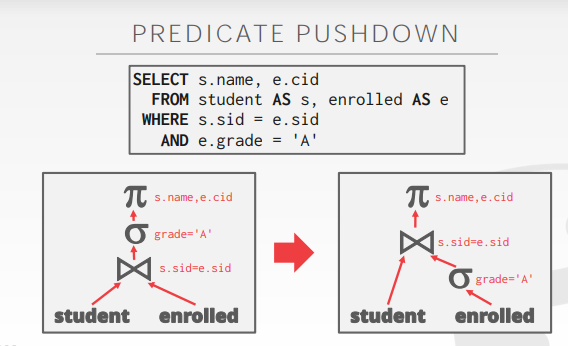
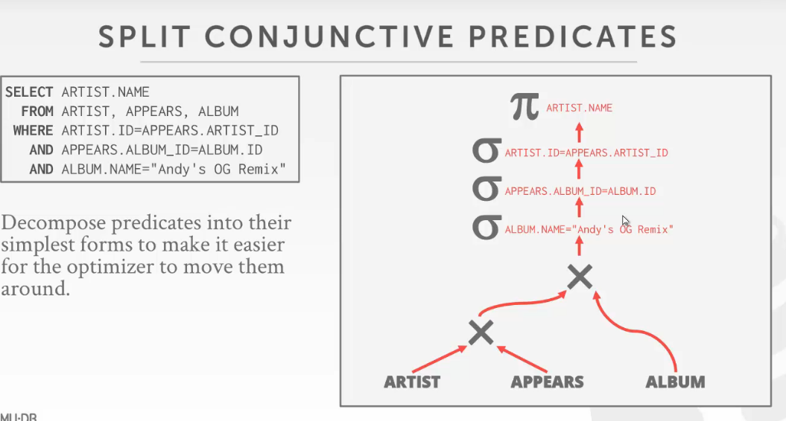
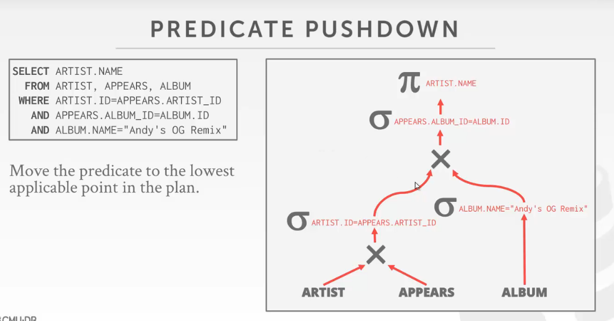
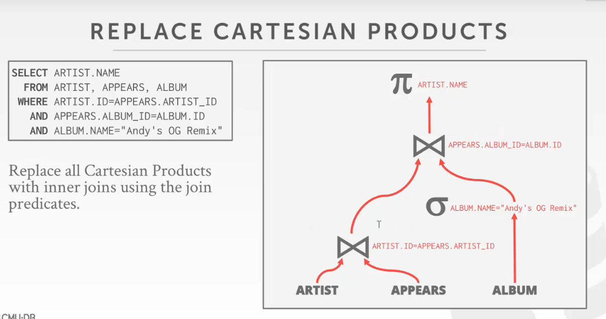
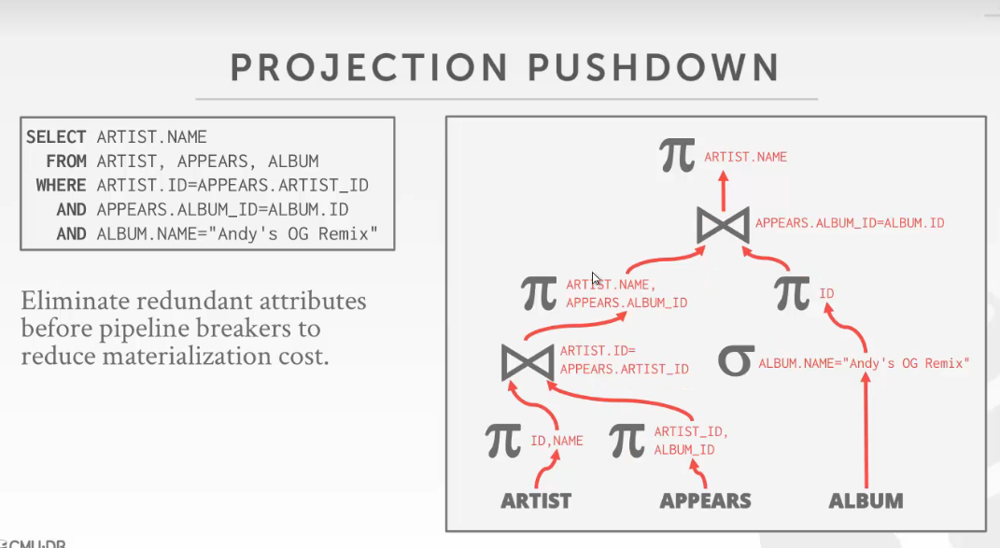
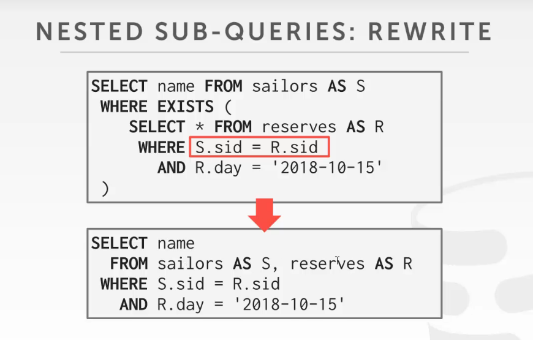
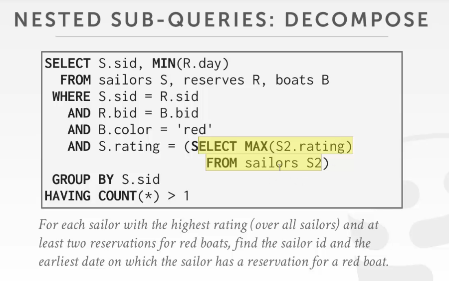

# background

- SQL是声明式的，即它只说明了需要的数据（答案）是什么，但没有说明要以什么方式去获取数据
- 所以DBMS可以对语句进行优化，从而在得到相同数据的同时提高性能
- 即不同的优化器，其效率都是不一样的
- 从IBM SYSTEM R，就开始了优化器的历程
- 一个争论：人为的制定的执行计划，和机器做出的执行计划，哪个效率会好一点
- 所以DBMS在执行上有两个流派，一个是sql为代表的，机器对语句进行优化
- 另一个是类似flink（虽然有插件，可以直接写sql），但是flink是要用户直接写具体语句的执行计划，流式处理系统


让DBMS帮我们做优化，有两个思路

- 启发（规则）：写一些规则或者变化的手段，用来优化用户sql语句中比较低效的部分（说白了就是一些trick，将语句等效的替换或变换，然后获取高效的性能）
  - 重写sql查询，去掉一些stupid或inefficient的查询
  - 需要查询catalog，需要看一下数据库表行列的情况（但是不需要数据的具体情况，即发现数据库有索引就直接走索引）
  - 用一些简单的规则实现的
- 基于代价（cost-based search）
  - 就需要构建代价模型，即判断不同的执行计划的cost是多少，从而选出最优
  - 要估计多个不同的plan的代价
  - 需要知道数据的分布，因为要知道算子要处理多少数据，才能够知道代价是多少


# architecture

- sql rewriter：对SQL语句进行一些预处理（一些简单的优化）

- parser：将SQL语句变为抽象语法树（abstract syntax tree）

- binder：语法树会涉及表的名称，列的名称；所以要将这些表的名称之类的和数据库表的id，列的id要对应上

  - 即将表名，列名转变为DBMS认识的id
  - 如果表或列不存在，就会报错
  - 去数据库的system catalog中bind对应的数据表id

- tree rewriter

  - 把上面的抽象语法树转化成一个优化器可以工作的最原始的逻辑结构
  - 生成一个最原始的logical plan

- 最后生成optimizer（这是一个未优化的查询逻辑）

  - 如果是启发式的，ruled based search，也叫做基于规则的查询，会查询一些系统的源数据，对查询进行优化

  - 如果是代价式的，就叫做cost model，不光会查询系统的原数据，还是查询代价模型（比如说DBMS规定的一些代价模型）

- 接着会生成一个物理的查询计划 physical plan

  - 每个算子，都是一个平时用的计算算子（真正执行的算子）


# logical and physical phan

- 逻辑计划：关系代数级别的（join）
- 物理计划：怎么执行这个join（比如说怎么执行join）
- 在优化器中，逻辑计划和物理计划的算子都是由对应关系的
- 物理计划会制定一个具体的执行方式，是走索引还是走扫描
  - 会根据具体的物理情况，决定使用哪些物理算子
  - 物理算子和逻辑算子不是一对一的关系，一个逻辑算子可能会有多个物理算子对应着


- 查询计划的优化，是一个NP问题
  - 优化器对查询的优化是一个很难的问题，以至于不知道是否有一个最优的结果存在
- 也有人用ML对优化器进行优化，比如DB2就用了人工智能优化器，但是优点类似黑盒，即查询器的输出很难make sense，就人工智能也不知道为什么要选择这个方式


- 还有一种思路就是辅助优化器对语句进行优化，即对于优化器给出的执行计划，提出建议
- 最后优化器自己综合做出决定


# relational algebra equivalences

- 关系代数的等价
- 如果两个关系表达式是等价的话，就表明二者输出的结果集是一样的
- 反之也是一样的
- 为什么这么有用，因为数据库可以借此判断两个语句是否在逻辑上是等价的，而不需要代价模型
- 也叫做查询的重写
- 
- 通过逻辑谓词的下推，实现了两个关系表达式的等效
- join的交换律
- 
- 发现这样的话，总共会有4的n次方种执行路径


- 早晚物化的问题
  - 是在join的时候就物化数据，还是最后再回表一次得到数据
- 但是这对于一个列存的数据库来说就无用了，因为都是晚物化的多


# logical query optimization

- 逻辑计划的优化
- 需要先写一些规则，再让数据库去匹配，pattern matching
- 缺点就是不能比较计划和计划之间的好坏（即这种方法不能自适应的评价计划和计划之间的好坏，选择方法一而不选择方法二的原因只能是因为你给的规则是这样写的，因为它没有代价模型，不能自己去判断）
- 优化的方向
  - split conjunctive predicates：把连接的谓词分开
    - 
    - 将语句中用and连接的谓词分开
  - predicate pushdown：谓词下推
    - 将谓词往下推，越接近读表越好
    - 
  - replace cartesian products with joins：把笛卡尔积变成join
    - 两个表连表后（即笛卡尔积）再用条件判断，就相当于一个join了，所以就可以把笛卡尔积变为join
    - 
  - projection pushdown：投影下推
    - 发现很多时候我们只需要部分列的数据，整行的记录没必要全部往上传，所以就值传递部分数据即可
    - 


# nested sub-queries

- 嵌套的子查询
- 两方面优化
  - 重写：将里面和外面的查询写成一个查询
  - 解耦查询，不要让子查询一直阻塞在主查询里面（把它单独拿出来，提前执行）


## rewrite

- 
- 发现可以直接用连表的方式来改写


## decompose

- 可以预先执行一些查询语句，使得主查询不必一直阻塞在子查询上
- 
- 如果不预先处理这个子查询的话，每拿一条记录都要再执行一遍这个子查询，极度的浪费资源
- 可以先把子查询先做了，然后把结果放到单独的一个表里面，用到的时候再去读取


# expression rewriting

- 对谓词表达式的重写 ，让谓词本身变得更高效

  - 可以给DBMS写入一些规则，然后让DBMS去SQL中查找符合规则的部分进行rewrite

- 比如说

  - ```SQL
    SELECT * FROM A WHERE 1 = 0;
    ```

- 这里1是不等于0的，所以这里可以直接优化为false，输出空结果即可


- 
- 发现一些语句可以直接得到结果，所以直接优化
- 
- 而这里相当于自己和自己连表，然后查询的又是自己的全部数据，所以可以变为`SELECT * FROM A`


## merge predicates

- 
- 
- 可以把一些谓词进行合并


# cost-based query

- 基于规则的优化，要根据数据库的数据来对执行计划的cost进行估计，从而选择最优的
- 但是，这里对执行计划的估计，换一个数据库就不适用了


# cost model components

- physical costs
  - 物理代价，需要多少cpu的计算，多少次IO，多少次miss cache，读下内存的开销，预取数据的开销
  - 依赖于硬件的性能（hardware）
  - 这种计算经常出现在数据库一体机上，oracle，因为硬件是不变的
  - 或者sql server上，通过windows对硬件的性能有深层次的把握
  - 商用的会做的比较细，开源的一般不会
- logical costs
  - 逻辑开销，针对每个算子估计其开销
  - 开销的计算和每个算子之间是独立的
  - 需要统计信息，以便知道算子处理多少数据，才能估计开销
- algorithmic costs
  - 比较细的估计算子的开销，从算法的层次去估计开销


## disk-based dbms cost model

- 相比cpu的开销，磁盘io的开销更大，更值得关注
- 同时要减少随机IO，改为顺序IO


## postgres costs model

- 用魔法数将磁盘IO的开销和cpu计算的开销联系在了一起
  - 魔法数：相当于用几个系数和算法间这二者联系起来为一个数字
  - 就相当于写死了，根据经验得到的
  - 比如说从硬盘中取数据，比从内存中取数据满了400倍
  - 顺序IO比随机IO快4倍
  - 而且里面很多算法都是基于这个魔法数的，不能随意修改


# conclusion

- 启发式的基于规则的优化器，基于规则（启发）去优化一个执行计划（不需要知道数据的内容的）
- 基于代价的模型，需要知道数据的统计信息，比上者更加先进