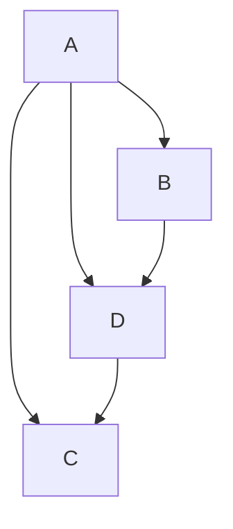
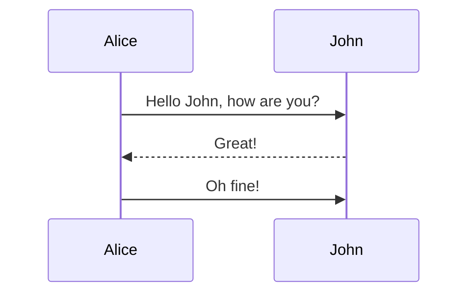

#### 流程图

#### 时序图

#### 添加音乐

<iframe frameborder="no" border="0" marginwidth="0" marginheight="0" width=330 height=86 src="//music.163.com/outchain/player?type=2&id=1488737309&auto=1&height=66"></iframe>

<iframe frameborder="no" border="0" marginwidth="0" marginheight="0" width=330 height=86 src="//music.163.com/outchain/player?type=2&id=1827600686&auto=1&height=66"></iframe>

<iframe src="//player.bilibili.com/player.html?aid=760480808&bvid=BV1J64y1C77V&cid=333748731&page=1" scrolling="no" border="0" frameborder="no" framespacing="0" allowfullscreen="true"> </iframe>

可以通过网易云或者bilibili视频分享的外链的添加音乐

- 比如以下网站https://music.163.com/#/outchain/2/1827600686/
- 或以下网站https://www.bilibili.com/medialist/play/ml220821212/BV1At411e7jj
- 添加图片的话就用picgo吧