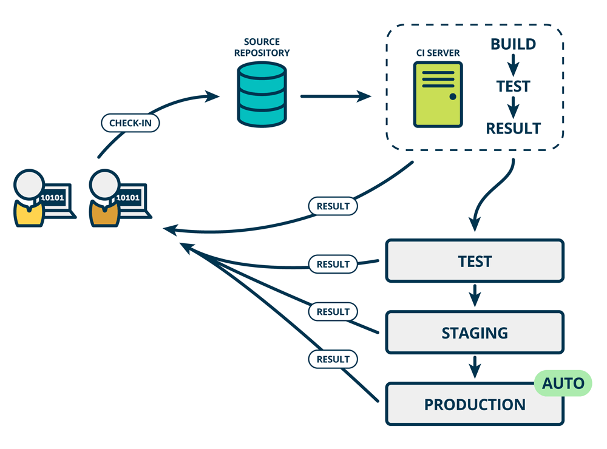

# Tool

This is a depository which records the note of operating system and some personal opintions in tools.

# To learn tools

- gtest
- gflags
- bazel
- backward-cpp
- memcheck
- valgrind

## 软件工程三要素

- **方法、工具和过程**

## uml多重度

- 是指一个类的实例能够与另一个类的多少个实例相关联

# CI/CD

Continuous Integration（CI）

- 持续集成
- 开发人员将会频繁地向主干提交代码，这些新提交的代码在最终合并到主干前，需要经过编译和自动化测试流进行验证
- 是在源代码变更后自动检测、拉取、构建和（在大多数情况下）进行**单元测试的过程**
- 目标是快速确保开发人员新提交的变更是好的，并且适合在代码库中进一步使用
- CI 的目标是将集成简化成一个简单、易于重复的日常开发任务， 这样有助于降低总体的构建成本并在开发周期的早期发现缺陷。 要想有效地使用 CI 必须转变开发团队的习惯，要鼓励频繁迭代构建， 并且在发现 bug 的早期积极解决
- 

Continuous Delivery（CD）

- 持续交付，是CI的拓展，其中软件交付流程进一步自动化，以便随时轻松地部署到生成环境中
- 成熟的持续交付方案也展示了**一个始终可部署的代码库**。使用 CD 后，软件发布将成为一个没有任何紧张感的例行事件。 开发团队可以在日常开发的任何时间进行产品级的发布，而不需要详细的发布方案或者特殊的后期测试
- 

- 在持续交付中，每个阶段（从代码更改的合并，到生产就绪型构建版本的交付）都涉及**测试自动化和代码发布自动化**。在流程结束时，运维团队可以快速、轻松地将应用部署到生产环境中或发布给最终使用的用户

Continuous Deployment（CD）

- 持续部署，扩展了持续交付，以便软件构建在通过所有测试时自动部署
- 在这样的流程中， 不需要人为决定何时及如何投入生产环境。CI/CD 系统的最后一步将在构建后的组件/包退出流水线时自动部署。 此类自动部署可以配置为快速向客户分发组件、功能模块或修复补丁，并准确说明当前提供的内容。采用持续部署的组织可以将新功能快速传递给用户，得到用户对于新版本的快速反馈，并且可以迅速处理任何明显的缺陷
- 随着 DevOps 的发展，新的用来实现 CI/CD 流水线的自动化工具也在不断涌现。这些工具通常能与各种开发工具配合， 包括像 GitHub 这样的代码仓库和 Jira 这样的 bug 跟踪工具。此外，随着 SaaS 这种交付方式变得更受欢迎， 许多工具都可以在现代开发人员运行应用程序的云环境中运行，例如 GCP 和 AWS。但是对于一个成熟的CI/CD管道（Pipeline）来说，最后的阶段是持续部署。作为持续交付——自动将生产就绪型构建版本发布到代码存储库——的延伸，持续部署可以自动将应用发布到生产环境
- 
- 持续部署意味着所有的变更都会被自动部署到生产环境中。持续交付意味着所有的变更都可以被部署到生产环境中，但是出于业务考虑，可以选择不部署。如果要实施持续部署，必须先实施持续交付。持续交付并不是指软件每一个改动都要尽快部署到产品环境中，它指的是任何的代码修改都可以在任何时候实施部署。持续交付表示的是一种能力，而持续部署表示的则一种方式；持续部署是持续交付的最高阶段
