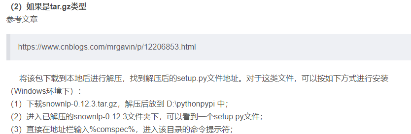

# 批量修改文件名

- 新建txt文件，修改一下内容后更改后缀为bat

  - ```bash
    ren *.gif *.jpg
    ```

  - 重命名命令，需要修改的文件类型，修改后的文件类型


# chrome67版本后无法拖拉安装crx插件

- https://huajiakeji.com/utilities/2018-09/1525.html


# word文档有不同的输入方式

- word有两种输入模式:插入模式和改写模式,一般默认的是插入模式,当变为改写模式后,在前面打字会把后面的文字覆盖掉
- 键盘上的insert键用于切换两种模式


# 解决：/usr/bin/env: ‘python’: No such file or directory

- 背景：运行python脚本的时候报错，但本地的确有python
- 解决办法：
  - 为其创建符号连接
  - 先用``whereis python`指令查询当前的python安装的位置
  - 然后用`sudo ln -s 上面得到的python的地址 /usr/bin/python`
  - 比如我的python安装的位置是/usr/bin/python3.8，所以指令就是`sudo ln -s /usr/bin/python3.8 /usr/bin/python`


# Gitee：Your push would publish a private email address.

- 背景：gitee的一个报错（之前做douyin项目的时候遇到的）
- 去gitee或github中把下面的邮箱的选项叉掉即可
- 


# Blog的搭建

- [φ(゜▽゜*)♪咦，又好了！](https://godweiyang.com/2018/04/13/hexo-blog/#toc-heading-8)
- [hexo博客网站主页空白或404 - 简书](https://www.jianshu.com/p/fc6f5a132bf0)
- [[Git\] hexo d时出现连接超时或者SSL错误的解决方法_richardxp888的博客-CSDN博客](https://blog.csdn.net/weixin_46087812/article/details/124575202)
- [mac 安装hexo 没有 hexo s命令， 求助_hexo吧_百度贴吧](https://tieba.baidu.com/p/5843629195)
- [hexo部署到github时，提示typeError [ERR_INVALID_ARG_TYPE\] The “mode“ argument must be integer. Receive_冰山一树Sankey的博客-CSDN博客](https://blog.csdn.net/m0_59464010/article/details/122761887)
- [TypeError [ERR_INVALID_ARG_TYPE\]: The “mode“ argument must be integer. Received an instance of_秦时明月之君临天下的博客-CSDN博客](https://blog.csdn.net/weixin_41287260/article/details/120254461)
- [git 更改当前分支的名称 - CSDN](https://www.csdn.net/tags/Ntzacg2sMjI1NS1ibG9n.html)
- https://blog.csdn.net/q1ngqingsky/article/details/123571347
- https://blog.csdn.net/weixin_44543463/article/details/119738094


常见的hexo指令

- `hexo d`上传文件
- `hexo s`本地运行服务器
- `hexo g`生成静态文件
- `hexo new post 'name_artical'`生成新文章（文件夹放source）


hexo上公式渲染错误：

- ```shell
  npm uninstall hexo-renderer-marked --save
  npm install hexo-renderer-kramed --save
  ```

- 更换 Hexo 的 markdown 渲染引擎，hexo-renderer-kramed 引擎是在默认的渲染引擎 hexo-renderer-marked 的基础上修改了一些 bug ，两者比较接近，也比较轻量级

- 上述方法不行

- 解决办法：在括号和括号之间加上空格，多加几个空格即可


# rust的安装

```shell
curl https://sh.rustup.rs -sSf | sh	//	输入后按空格即可
source $HOME/.cargo/env //	配置系统变量
chmod +x $HOME/.cargo/env	//	如果上一条指令的权限不够，就chmod权限
rustc --version	//	查看rust的版本
```


# windows下系统变量无法展开

可能是把%JAVA_HOME%\bin和%JAVA_HOME%\bin一起放在了Path开头，导致不能展开的问题

- 解决办法，把%开头的系统变量放到后面，不要放在第一位


# 某些github项目中，python代码无运行

可能是它开头写了`#!/bin/python`，导致windows下无法运行代码

- python作为脚本语言，所以可以在代码中执行shell类的脚本，有点小坑....


# python库的安装方法

方法一：pip install 库名

- 或者，pip install --upgrade 库名

方法二：pycharm 中，在python的设置中直接安装

方法三：去**https://pypi.org/project/snownlp/**上下载原文件

文件是tar类型时的安装：



文件是whl类型时的安装：

- 先安装 pip install wheel
- 然后安装 .whl 文件 pip install 路径\文件名.whl
  - 例如放在D盘根目录时安装： pip install D:\\文件名.whl


# jdk的下载

- https://injdk.cn
