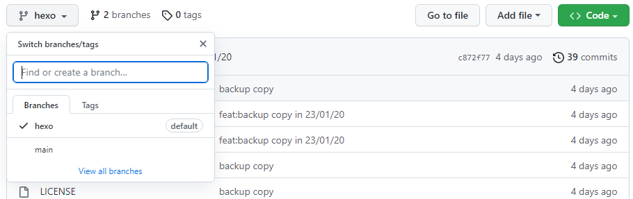
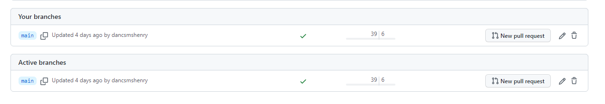
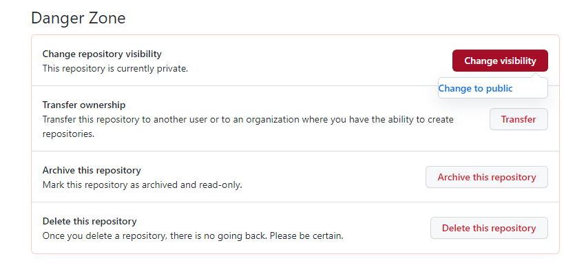

# git 基本概念

## 工作区

当前目录下的文件

<br/>

## 暂存区

使用 git add 后，会先把文件放到暂存区中

<br/>

## 本地仓库

使用 git commit 后，会把暂存区的文件放到本地仓库中

<br/>

## 远程仓库

使用 git push 后，会把文件推送到远程仓库中

<br/>

<br/>

<br/>

# git 学习理念

不求学的全面，只求把日常需要的掌握即可

- 比如常用的指令以及 git 的原理

<br/>

<br/>

<br/>

# git 常用命令

## add

```shell
# 将某个文件的修改提交到暂存区
git add filename

# 将所有发生修改的、新增的文件添加到暂存区中
git add .
```

<br/>

## branch

```shell
# 创建分支
git branch branch_name

# 删除分支
git branch -d branch_name
git branch -D branch_name # 强制删除该分支

# 查看分支
git branch # 查看本地所有分支（其中带有星号的是当前分支）
git branch -a # 查看本地和远程的所有分支

# 重命名分支
git branch -m old_name new_name
```

<br/>

## checkout

```shell
# 切换到指定分支
git checkout branch_name

# 创建分支并切换到该分支上
git checkout -b branch_name

# 以某次 commitid 的代码创建新的分支，并切换到该分支上
git checkout -b branch_name commit_id

# 将工作区的代码恢复至暂存区的状态
git checkout .

# 以某个 commitid 的代码创建一条临时的分支，并切换到这条临时分支上
# 此时的 HEAD 处于游离状态，并不指向任何分支，如果切到其他的分支上，该临时分支就会消失
git checkout commit_id

# 将某个文件的内容，恢复至暂存区的状态
git checkout file_name

# 将某个文件夹的内容，恢复至暂存区的状态
git checkout file_folder
```

<br/>

假设当前是在分支的最新的一次提交上

`git checkout commit_id` 可以获取某次 commitid 时的代码，并替换至工作区

如果希望回到最新的一次提交上，就 `git checkout master`

<br/>

记录一次关于 git checkout 的问题

因为我最开始没有在本地创建分支（之前的开发都是在本地修改提交，所以不需要创建分支；此时的 HEAD 就是游离状态 detached）

而当我使用了 `git checkout commit_id` 后，此时 HEAD 依然是游离的（HEAD detached at 09cb312）

如果想要回到最开始的状态（即刚拉下代码的那个版本），使用 `git checkout master` 必然是回不去的

所以此时需要先`git checkout origin/master` 同步到远程的 master 分支上

（这里可以用 `git branch -a` 查看远程主机的名字，接着再 checkout）

注：不能删除当前所在的分支；`git checkout origin/master` 会使得 HEAD 变为游离状态

<br/>

## clone

```shell
# 将代码 clone 到当前目录中
git clone url

# 将代码 clone 到指定目录中
git clone url folder_path
```

<br/>

## commit

```shell
# 提交 commit，并添加 commit 信息
git commit -m "message"

# 等价于 git add -a 和 git commit -m "message"
git commit -am "message"

# 在不增加一次新 commit 的情况下将新修改的代码追加到上一次的 commit 中（会弹出一个编辑器界面重新编辑 message 信息）
# 一般用于代码 review 后出现问题，修改后再提交
git commit --amend

# 在不增加一个新 commit 的情况下将新修改的代码追加到前一次的 commit 中（不需要再修改 message 信息）
git commit --amend --no-edit
```

<br/>

## config

```shell
# 有三个级别 local （项目级别）， global （用户级别）和 system （机器级别）
# 一般默认是 local 级别

# 设置 name
git config --global user.name "username"

# 设置邮箱
git config --global user.email "useremail"

# 查看当前账号信息
git config --global --list
```

<br/>

## init

```shell
# 在当前目录创建 git 仓库
git init

# 在指定 path 路径下创建 git 仓库
git init folder_path
```

<br/>

## log

```shell
# 显示当前仓库的提交 commit 记录（从远到近）
git log
```

<br/>

## mv

```shell
# 给文件/文件夹重命名
# 如果文件名中有空格，需要用""括起来
git mv old_name new_name
git mv -f old_name new_name	# 若新文件/文件夹已经存在，可以强制覆盖

# 注：可以直接给文件重命名，但是 git 会判定为删除了旧文件，并添加了新文件
```

<br/>

## merge

```shell
# 合并分支（将指定分支合并到当前分支中）
git merge branch_name

# 退出 merge 过程
git merge --abort

# 继续 merge 过程
git merge --continue
```

<br/>

## pull

```shell
# 拉取远程仓库指定分支上最新的代码
# 等价于 fetch + merge
git pull remote_name branch_name
```

<br/>

## push

```shell
# 推送代码到远程仓库的指定分支上
# 向远程仓库推送指定分支
git push remote_name branch_name
```

<br/>

## rebase

```shell
# 对过去的 n 次提交进行相应的操作
git rebase -i HEAD~n

# 变基某个分支
git rebase <branch>

# 退出 rebase 过程，常在处理冲突出错时使用
git rebase --abort

# 继续 rebase 过程，常在处理完冲突时使用
git rebase --continue
```

<br/>

rebase 合并此前的 n 次提交：

例如说要将前 4 次提交全部都合并在一起

`git rebase -i commit_id` 这里的 commit_id 应该是前五次的 commit_id（这里也可以 `git rebase -i HEAD~4`）

进入界面后，将前四次的 commit 前的字母单词全部改为 squash ，然后保存，ctrl + x 退出

接着再进入界面修改 commit message，保存，ctrl + x 退出

最后 git push origin master

<br/>

## reset

```shell
# 常用的三个参数： --hard，--soft，--mixed

# 将当前仓库的版本，回退到过去某次 commit 的时候
# 此处的 HEAD^ （回退多少个版本，就加几个^）可以换成 commitid（可以只写 id 的前几位）
git reset --hard HEAD^ # 回退到某个版本，并将当时 commit 提交的内容以及当前工作区和暂存区的内容全部删掉
git reset --soft HEAD^ # 回退到某个版本，并将当时 commit 提交的内容保存至暂存区，且不会破坏当前工作区和暂存区（一般用于撤销本地仓库中未提交（到远程仓库）的 commit）

# 将暂存区的修改撤销至工作区
git reset filename

# 撤销所有的修改至工作区
git reset
```

<br/>

## remote

```shell
# 添加与远程仓库关联
git remote add <name> <url>

# 删除与远程仓库关联
git remote remove <name> <url>
```

<br/>

## rm

```shell
# 删除工作区某个文件，并将此次删除放入到暂存区
git rm file_name
git rm -f -r . # 删除工作区所有的文件

# 删除工作区和暂存区的某个文件，并将此次删除放入暂存区
git rm -f file_name

# 删除暂存区文件，并将此次删除放入暂存区，但会保留工作区的文件
# 可以理解成解除 git 对这些文件的追踪，将他们转入 untracked 状态
git rm --cached file_name
```

<br/>

## reflog

```shell
# 查看过去执行的 git 指令
git reflog
```

<br/>

## status

```shell
# 显示文件和文件夹在工作区和暂存区的状态
git status
```

<br/>

## stash

```shell
# 将当前的工作进度保存到栈里面，并将工作区和暂存区恢复到本次修改之前
# stash 命令默认不包含未跟踪的文件（新建的文件需要被 add 之后，才能被跟踪）
git stash
git stash save message # message 表示对此次保存的声明
git stash -u # 使用该指令可以保存未被 git 跟踪的文件

# 删除所有保存的工作进度
git stash clear

# 显示保存的工作进度列表，编号越小代表保存进度的时间越近
git stash list

# 恢复已保存的工作进度，顺序是先进后出
git stash pop # 不带选项，则默认恢复到最近的一次工作进度中
git stash pop stash@{0} # 带选项，则表示恢复到指定进度上

# 删除已保存的工作进度
git stash drop # 不带选项，则删除最近保存的工作进度中
git stash drop stash@{0} # 带选项，则表示删除指定的工作进度
```

<br/>

## show

```shell
# 依次显示每次 commit 的具体提交信息和数据变更信息
git show

# 显示某次具体的 commitid 对应的提交信息和数据变更信息
git show commit_id

# 显示某条分支对应的提交信息和数据变更信息
git show branch_name
```

<br/>

<br/>

<br/>

# git commit message 规范

`<type>[(<scope>)]: <subject>`

**type**，声明本次代码提交的类型（英文名，必填项）：

feat：新功能特性

fix：bug修复

perf：功能优化，包括性能优化、体验优化等

refactor：代码重构（大范围的代码结构重构，不涉及代码功能）

style：格式调整（小范围的代码格式调整，不涉及代码功能）

merge：代码分支合并

revert：代码版本回滚

test：测试代码变动

doc：文档变动

chroe：工具的变动

<br/>

**scope**，用于声明本次代码提交的影响范围（建议英文，选填项）

如 Model 层、Dao 层、Service 层、Controller 层、View 层等等

如果涉及多个 scope，可以置空或用*代替

<br/>

**subject**，用于声明本次代码提交的描述信息（建议中文，必填项）。通常控制在50个字符内，且省略句末标点符号

<br/>

<br/>

<br/>

# github 网页上的操作

## 删除分支



<br/>

点进 view all branches



点进右边的垃圾桶

<br/>

## 将仓库设为私有

点进 settings



<br/>

<br/>

<br/>

# git 基本配置

## vscode 和 git 的配置

前提：

- git，vscode 已安装
- 密钥都已配置
- github 上的仓库已创建

首先在本地创建文件夹，进入文件夹在命令行输入 `git init`

然后输入 `git remote add origin 仓库的 ssh 链接`

接着输入 `git pull origin main`，到这里算是已经完成了

但 vscode 有一个比较坑的地方，它的默认分支是 master，而 git 的默认分支是 main，所以需要根据需求对分支进行删除

PS：vscode 在左下角切换分支

```shell
# 根据具体的要求对内容进行修改
mkdir muduo
cd muduo
git init
# 这里需修改远程主机的地址及仓库的 ssh 链接地址
git remote add origin git@github.com:dancsmshenry/annotation_of_muduo.git
git pull origin main
git checkout -b main
git branch -d master
```

