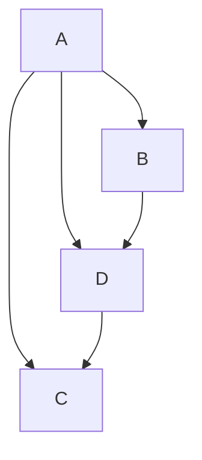
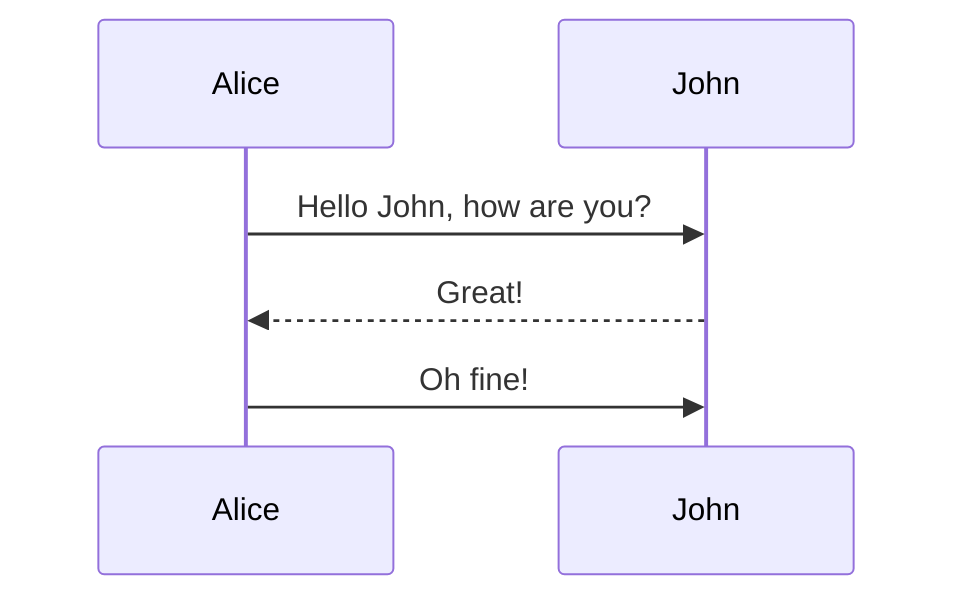

# 一级标题

## 二级标题

### 三级标题

#### 四级标题

##### 五级标题

###### 六级标题

```shell
# 语法： 
# ctrl + 数字（typora 独有）
# 加数个 # 在前面，再回车
```

<br/>

<br/>

<br/>

# 代码块

文章中的代码段 `#include <cstdio>`

<br/>

```c++
// 这是 c++ 代码段
```

<br/>

```shell
# 语法：
# 文章中的代码段 `#include <cstdio>`
# ``` + 所要写的语言 + 回车 + ```
```

<br/>

<br/>

<br/>

# 字体

**加粗的文字**

*斜体的文字*

***加粗斜体的文字***

==高亮的文字==

~~被删除的文字~~

> 一级引用
>
> > 二级引用
> >
> > > 三级引用

<u>下划线上的文字</u>

<br/>

```shell
# 语法：
# **加粗的文字**

# *斜体的文字*

# ***加粗斜体的文字***

# ==高亮的文字==

# ~~被删除的文字~~

# > 一级引用
# >
# > > 二级引用
# > >
# > > > 三级引用

# <u>下划线上的文字</u>
```

<br/>

<br/>

<br/>

# 分割线

---

***

<br/>

```shell
#语法：
#    --- + 回车
#    *** + 回车
```

<br/>

<br/>

<br/>

# 插入图片


<br/>

```java
语法：
    
```

<br/>

<br/>

<br/>

# 超链接

[这里是bilibili](https://www.bilibili.com/)

```shell
# 语法：[超链接的名字](超链接的网址) 回车
```

<br/>

<br/>

<br/>

# 列表

- 目录一
- 目录二

<br/>

1. 目录一
2. 目录二
3. 目录三

<br/>

嵌套：

1. 目录一
   - 第一页

<br/>

按两下回车后清楚格式

```shell
#语法：
#    无序列表： - + 空格 + 内容 + 回车
#    有序列表： 数字 + 空格 + . + 回车
#    嵌套：
#    	（在前面tab，重新开一个列表即可）
```

<br/>

<br/>

<br/>

# 表格

|      |      |
| ---: | :--- |
|      |      |

右键插入表格

<br/>

<br/>

<br/>

# 脚注

这是被脚注的部分[^脚注部分]

<br/>

```java
语法：
    这是被脚注的部分[^脚注部分]
```

<br/>

<br/>

<br/>

# 流程图



<br/>

<br/>

<br/>

# 时序图



<br/>

<br/>

<br/>

# 音乐

<iframe frameborder="no" border="0" marginwidth="0" marginheight="0" width=330 height=86 src="//music.163.com/outchain/player?type=2&id=1488737309&auto=1&height=66"></iframe>

<iframe frameborder="no" border="0" marginwidth="0" marginheight="0" width=330 height=86 src="//music.163.com/outchain/player?type=2&id=1827600686&auto=1&height=66"></iframe>

<iframe src="//player.bilibili.com/player.html?aid=760480808&bvid=BV1J64y1C77V&cid=333748731&page=1" scrolling="no" border="0" frameborder="no" framespacing="0" allowfullscreen="true"> </iframe>

可以通过网易云或者bilibili视频分享的外链的添加音乐

- 比如以下网站https://music.163.com/#/outchain/2/1827600686/
- 或以下网站https://www.bilibili.com/medialist/play/ml220821212/BV1At411e7jj
- 添加图片的话就用picgo吧

<br/>

<br/>

<br/>

# 数学公式

## 上下标

- $$
  a_2, a_{22}\\\\
  a^2,a^{22}\\\\
  P_{5}^{2},P^3_{6}
  $$

- ```html
  a_2,a_{22}
  a^2,a^{22}
  <!--如果是单个字符就是前者，否则就是后者-->
  P_{5}^{2}
  ```

<br/>

<br/>

<br/>

## 分数

- $$
  \frac{7x+5}{3x+8}
  \frac{\frac{7x+5}{2x+1}}{x+1}\\\\
  \cfrac{b}{a}
  \cfrac{\cfrac{c}{b}}{a}
  $$

- ```html
  \frac{7x+5}{3x+8}
  \frac{\frac{7x+5}{2x+1}}{x+1}
  <!--适应大小-->
  \cfrac{b}{a}
  \cfrac{\cfrac{c}{b}}{a}
  ```

<br/>

<br/>

<br/>

## 开根号

- $$
  \sqrt{2},\sqrt[n]{5}
  $$

- ```html
  \sqrt{2},\sqrt[n]{5}
  ```

<br/>

<br/>

<br/>

## 省略号

- $$
  \cdot,\cdots\\\\
  \vdots\\\\
  \ddots
  $$

- ```html
  \cdot,\cdots\\
  \vdots\\
  \ddots
  ```


## 极限

- $$
  \lim\\\\
  \infty
  $$

- ```html
  \lim\\
  \infty
  ```

<br/>

<br/>

<br/>

## 括号

- $$
  (\frac{a}{b}),[\frac{b}{a}],\\\\
  \left(\frac{a}{b}\right),\left[\frac{b}{a}\right],
  $$

- ```html
  (\frac{a}{b}),[\frac{b}{a}],
  \left(\frac{a}{b}\right),\left[\frac{b}{a}\right],
  ```

- $$
  \{\frac{a}{b}\},\langle \frac{d}{e}\rangle,\\\\
  \left\{\frac{a}{b}\right\},\left \langle \frac{d}{e} \right\rangle
  $$

- ```html
  \{\frac{a}{b}\},\langle \frac{d}{e}\rangle,\\
  \left\{\frac{a}{b}\right\},\left \langle \frac{d}{e} \right\rangle
  ```

- $$
  \lceil a \rceil, \lfloor a \rfloor\\\\
  \left\lceil \frac{b}{a} \right\rceil, \left\lfloor \frac{b}{a} \right\rfloor
  $$

- ```html
  \lceil a \rceil, \lfloor a \rfloor\\
  \left\lceil \frac{b}{a} \right\rceil, \left\lfloor \frac{b}{a} \right\rfloor
  ```

<br/>

<br/>

<br/>

## 累加累乘

- $$
  \sum^{N}_{i = 0}\\\\
  \prod^{N}_{i = 0}
  $$

- ```html
  \sum^{N}_{i = 0}\\
  \prod^{N}_{i = 0}
  ```

<br/>

<br/>

<br/>

## 微积分

- $$
  \int\\\\
  \iint\\\\
  \iiint\\\\
  \iiiint\\\\
  \oint\\\\
  \nabla
  $$

- ```html
  \int
  \iint
  \iiint
  \iiiint
  \oint
  \nabla
  ```

<br/>

<br/>

<br/>

## 附加标记

- $$
  \tilde{a}\\\\
  \vec{a}\\\\
  \overline{a+b+c+d}\\\\
  \underline{a+b+c+d}\\\\
  \overbrace{a+b+c+d}\\\\
  \underbrace{a+b+c+d}
  $$

- ```html
  \tilde{a}\\\vec{a}\\\overline{a+b+c+d}\\\underline{a+b+c+d}\\\overbrace{a+b+c+d}\\\underbrace{a+b+c+d}
  ```

<br/>

<br/>

<br/>

## 分支公式

- $$
  \left\{
  \begin{aligned}
  a=b\\\\
  b=c
  \end{aligned}
  \right.
  $$

- ```html
  \left\{\begin{aligned}a=b\\b=c\end{aligned}\right.
  ```

<br/>

<br/>

<br/>

## 三角函数

- $$
  \sin,\cos,\tan\\\\
  \cot,\sec,\csc\\\\
  \bot,\angle\\\\
  90^\circ,180^\circ
  $$

- ```html
  \sin,\cos,\tan\cot,\sec,\csc\bot,\angle90^\circ,180^\circ
  ```

<br/>

<br/>

<br/>

## 对数函数

- $$
  \ln17,\ln{a+b}\\\\
  \log_2 10\\\\
  \lg7,\lg{a+b}
  $$

- ```html
  \ln17,\ln{a+b}\\\log_2 10\\\lg7,\lg{a+b}
  ```

<br/>

<br/>

<br/>

## 二元运算符

- $$
  +,-,\times,\div\\\\
  \ast,\mid
  $$

- ```html
  +,-,\times,\div\\\ast,\mid
  ```

<br/>

<br/>

<br/>

## 关系运算符

- $$
  \neq, \leq, \geq\\\\
  \equiv,\approx

$$
- ```html
  \neq, \leq, \geq\\
  \equiv,\approx
  ```


##### 逻辑运算符

- $$
  \because\\\\
  \therefore\\\\
  \forall\\\\
  \vee\\\\
  \wedge
$$

- ```html
  \because\\\therefore\\\forall\\\vee\\\wedge
  ```

- 

<br/>

<br/>

<br/>

## 集合

- $$
  \emptyset,\in,\notin\\\\
  \subset,\not\subset,\subseteq\\\\
  \cap,\cup
  $$

- ```html
  \emptyset,\in,\notin\\\subset,\not\subset,\subseteq\\\cap,\cup
  ```

<br/>

<br/>

<br/>

## 矩阵

- $$
  \begin{matrix}
  	1 & 2 & 3\\\\
  	4 & 5 & 6\\\\
  	7 & 8 & 9
  \end{matrix}\\\\
  \left(
  \begin{matrix}
  	1 & 2 & 3\\\\
  	4 & 5 & 6\\\\
  	7 & 8 & 9
  \end{matrix}
  \right)\\\\
  \left[
  \begin{matrix}
  	1 & 2 & 3\\\\
  	4 & 5 & 6\\\\
  	7 & 8 & 9
  \end{matrix}
  \right]\\\\
  \left\{
  \begin{matrix}
  	1 & 2 & 3\\\\
  	4 & 5 & 6\\\\
  	7 & 8 & 9
  \end{matrix}
  \right\}\\\\
  $$

- ```html
  \begin{matrix}	1 & 2 & 3\\	4 & 5 & 6\\	7 & 8 & 9\end{matrix}\\\left(\begin{matrix}	1 & 2 & 3\\	4 & 5 & 6\\	7 & 8 & 9\end{matrix}\right)\\\left[\begin{matrix}	1 & 2 & 3\\	4 & 5 & 6\\	7 & 8 & 9\end{matrix}\right]\\\left\{\begin{matrix}	1 & 2 & 3\\	4 & 5 & 6\\	7 & 8 & 9\end{matrix}\right\}\\
  ```

<br/>

<br/>

<br/>

# markdown的快捷键

`ctrl + z` 撤销

`ctrl + y` 取消撤销

`ctrl + s` 保存

`ctrl + B` 加粗

`ctrl + I` 斜体

`ctrl +U` 下划线

`ctrl + shift +  (esc下面那个)`单行代码

`ctrl +shift + K` 代码块

`alt + shift + 5 `删除线

`ctrl + k `超链接

`ctrl + \ `清除样式

`ctrl + / `注释

`ctrl + c` 复制

`ctrl + v `粘贴

`ctrl + x` 剪切

`ctrl + shift + C` 复制为markdown

`ctrl+ shift + v` 粘贴为纯文本

`ctrl + 0~6 `六级标题一一对应

`ctrl + T` 插入表格

`ctrl + shift +q `引用

`ctrl + [ `减少缩进

`ctrl + ]`增加缩进

`ctrl + shift + [ `有序列表

`ctrl + shift + ]`无序列表

提升标题等级`ctrl + =`

降低标题等级 `ctrl + -`

显示隐藏侧边栏 `ctrl + shift + L`

